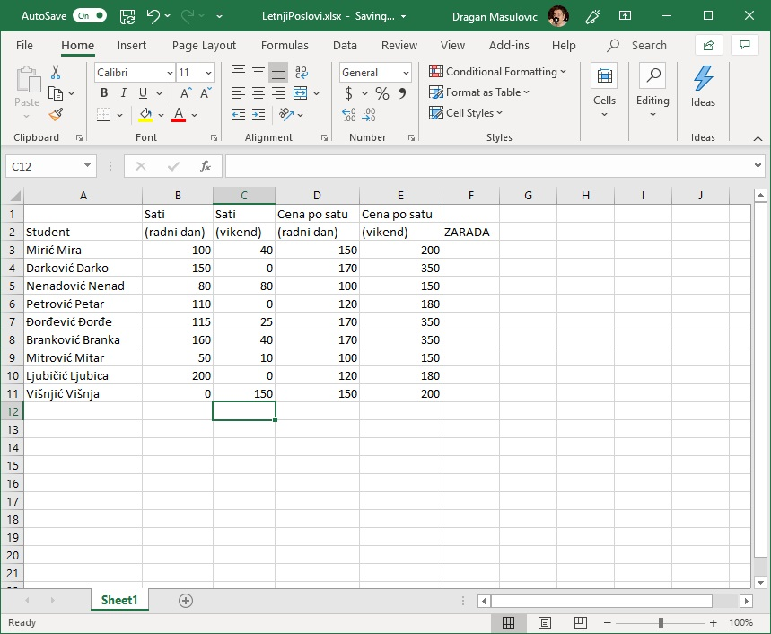
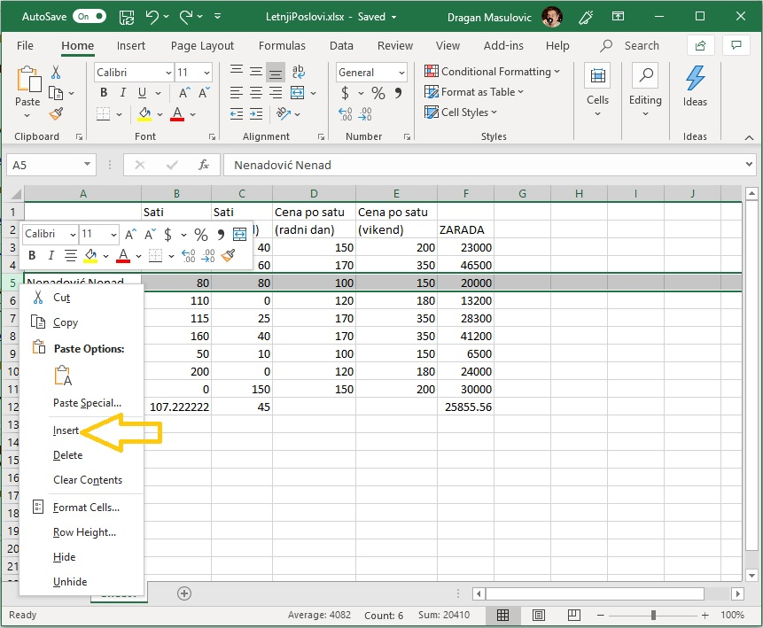
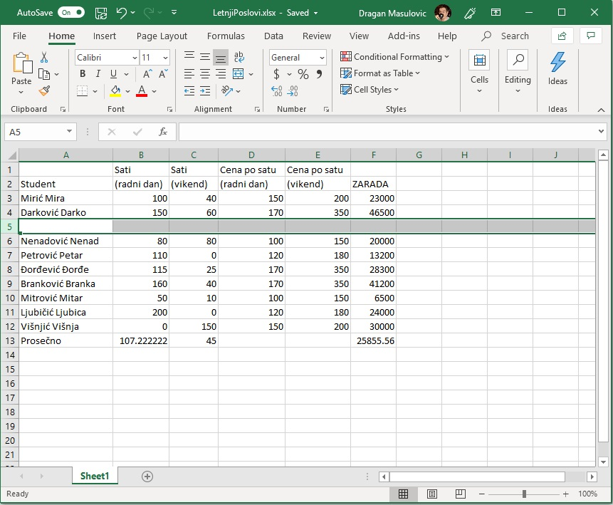
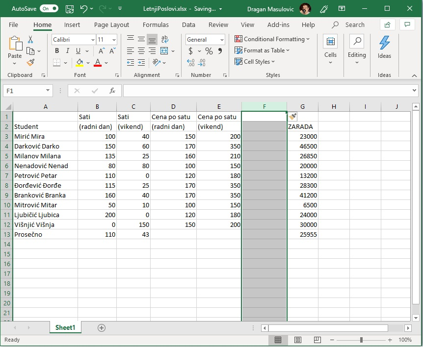
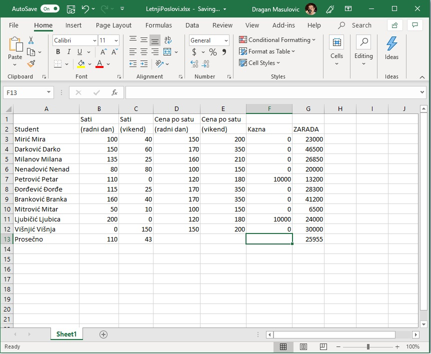
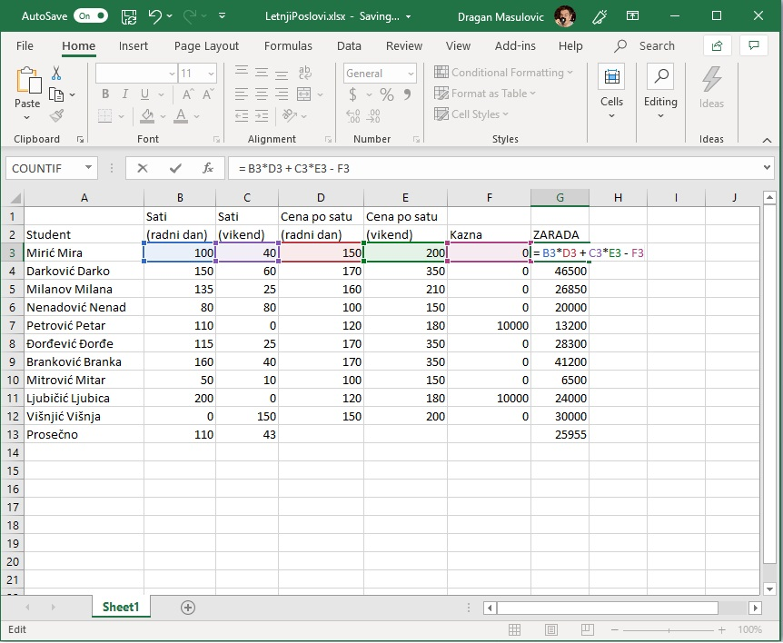
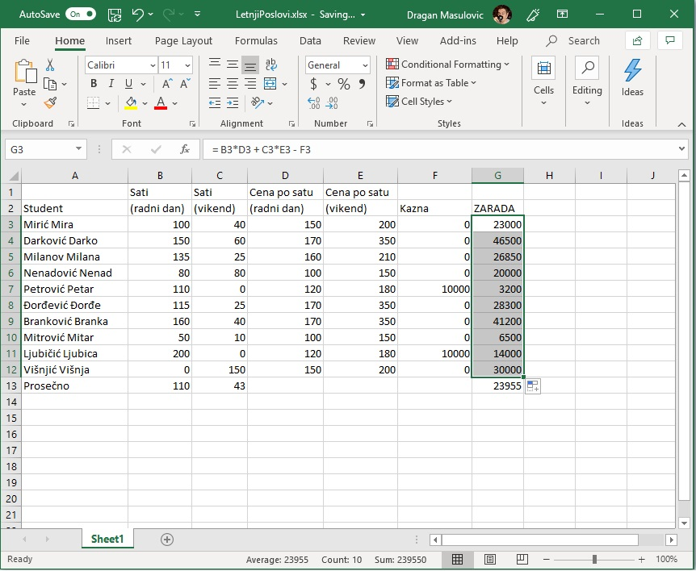

Аутоматска рекалкулација
=========================

На овом часу ћемо:

1. поновити унос формула у табелу,
2. поновити унос бројева и формула у табелу,
3. показати брзо копирање формула,
4. показати аутоматску рекалкулацију у случају измене података, и
5. показати додавање врста и колона табели.

Пример: Летњи послови
----------------------

Неколико студената је током лета радило преко Студентске задруге како би зарадили мало новца за летовање.
Студентска задруга плаћа послове по сату, с тим да је накнада за сат рада током радног дана нижа од накнаде за сат
рад преко викенда. Студенти су радили на различитим пословима, па се и накнаде разликују.

Преузимање табеле и покретање Ексела
-------------------------------------

**Корак 1.** Преузми табелу са следећег линка `LetnjiPoslovi.xlsx <https://petljamediastorage.blob.core.windows.net/root/Media/Default/Kursevi/programiranje_II/epodaci/LetnjiPoslovi.xlsx>`_
тако што ћеш кликнути на линк *десним тастером миша ("чудни клик")* и онда у малом менију који се појави одабрати опцију
"Save link as..." како је то показано на следећој слици:

.. image:: ../../_images/Recalc2.jpg
   :width: 600px
   :align: center

**Корак 2.** Пронађи табелу на свом рачунару (највероватније је завршила у *Downloads* фолдеру) и отвори је:

.. image:: ../../_images/Recalc1.jpg
   :width: 600px
   :align: center

Унос података и формула у табелу
--------------------------------

**Корак 3.** Сада за сваког студента унеси бројеве који представљају сате проведене на послу радним даном и викендом.
Унеси произвољне вредности. Када завршиш табела треба да изгледа овако (с тим да ћеш ти имати другачије вредности у колонама B и C):

**Корак 4.** Израчунај колико је сваки студент зарадио на свом летњем послу. За првог студента на списку коначна зарада се рачуна по формули
::

    = B3*D3 + C3*E3

.. image:: ../../_images/Recalc4.jpg
   :width: 600px
   :align: center

Како гласи формула за другог студента?

.. image:: ../../_images/Recalc5.jpg
   :width: 600px
   :align: center

Вероватно ти се по глави већ мота она народна "И тако летњи дан до подне". Да не бисмо исти досадни посао радили још сто пута (и при томе вероватно направили доста грешака) *сада ћемо показати користан трик који ће за нас урадити посао.* Кликни на ћелију F4 и примети да је доњи десни угао зеленог оквира око ћелије истакнут (оквир има "бубуљицу"):

.. image:: ../../_images/Recalc6.jpg
   :width: 600px
   :align: center

Ухвати мишем бубуљицу и "развуци оквир" до дна колоне. Ексел ће попунити ћелије неким вредностима:

.. image:: ../../_images/Recalc7.jpg
   :width: 600px
   :align: center

Кликни сада, рецимо, на ћелију F9 и погледај у оквиру за формуле (*formula bar*) која формула је уписана у ћелију.

.. image:: ../../_images/Recalc8.jpg
   :width: 600px
   :align: center

**Ооооо, да! Ексел је "погодио" коју формулу смо желели да упишемо у ћелију!**

Да буде одмах јасно, ово није никаква магија већ прост алгоритам. На основу формуле која је била уписана у ћелију F4 Ексел је простим алгоритмом генерисао формуле и уписао их редом у све ћелије кроз које смо "развукли оквир". Идеја алгоритма је да се слова у адреси ћелије не мењају, а бројеви у адреси ћелије се редом повећавају. Ево и табеларног прегледа:

.. csv-table:: Формуле у одговарајућим ћелијама табеле
   :header: "Ћелија", "Формула"
   :align: left

   "F3", "= B3*D3 + C3*E3"
   "F4", "= B4*D4 + C4*E4"
   "F5", "= B5*D5 + C5*E5"
   "F6", "= B6*D6 + C6*E6"

и тако даље. Ова погодност се зове *брзо копирање формула* и често ћемо је користити.

**Корак 5.** Израчунаћемо сада колико су просечно сати радили студенти радним данима и викендом, и колико су зарадили у просеку. Ексел уме аутоматски да израчуна просек низа бројева. Само треба позвати функцију AVERAGE (енгл. "просек").

У ћелију A12 упиши "Prosečno". Сада желимо да у ћелији B12 прикажемо просечно време које су наведени студенти провели на послу. Дакле, желимо да израчунамо просек бројева који су уписани у ћелије B3, B4, ..., B11. Један начин да то урадимо је да у ћелију унесемо формулу
::

    = (B3 + B4 + B5 + B6 + B7 + B8 + B9 + B10 + B11)/9

али постоји бржи начин! У ћелију B12 ћемо унети формулу
::

    =AVERAGE(B3:B11)

која рачуна просек (AVERAGE) бројева у ћелијама B3, B4, ..., B11 (B3:B11). "AVERAGE" је још једна функција коју Ексел познаје.

.. image:: ../../_images/Recalc9.jpg
   :width: 600px
   :align: center

На исти начин ћемо израчунати просек бројева у ћелијама C3:C11 и F3:F11

.. image:: ../../_images/Recalc10.jpg
   :width: 600px
   :align: center

Аутоматска рекалкулација и додавање врста и колона табели
----------------------------------------------------------

**Корак 6.** Сада се мало играј са бројевима. Промени неке вредности и примети како Ексел аутоматски прерачунава све ћелије чија вредност зависи од начињене измене.

.. image:: ../../_images/Recalc11.jpg
   :width: 600px
   :align: center

То је највећа снага Ексела! Можемо да се играмо са подацима, а сав рачун ће машина урадити за нас.

*То је и циљ модерног рачунарства: све досадне послове треба препусити машини што ће нама, људима, олакшати да испољимо своју креативност!*

**Корак 7.** Администрација Студентске задруге је заборавила да у табелу унесе једног студента. Уметнућемо врсту између Дарка и Ненада и њу попунити подацима о том студенту.

Десним ("чудним") кликом кликни на редни број врсте 5 (баш на број 5) и у малом менију који се појавио одабери "Insert":

Појавиће се нова празна врста:

Унеси неко име и неке податке о радним сатима и накнадама, као и формулу за обрачун зараде, рецимо овако:

.. image:: ../../_images/Recalc14.jpg
   :width: 600px
   :align: center

и уочи да је *Ексел аутоматски прерачунао све податке у табели!*

**Корак 8.** Администрацији Студентске задруге је потом јављено да неки студенти нису испоштовали уговор са фирмом код које су радили преко лета и да због тога треба да буду кажњени (новчано). Зато ћемо уметнути нову колону између колона E и F и у њу унети податке о казнама.

Десним ("чудним") кликом кликни на име колоне F (баш на слово F) и у малом менију који се појавио одабери "Insert":

.. image:: ../../_images/Recalc15.jpg
   :width: 600px
   :align: center

Појавиће се нова празна колона:

У ћелију F2 упиши "Kazna" и попуни остале ћелије колоне F (ако студент није кажњен упиши 0), рецимо овако:

Овај пут Ексел није ништа прерачунао аутоматски: вредности зараде се нису измениле! Разлог је то што Ексел не зна како да укључи нове податке у обрачун зараде -- *за то нам је потребна нова формула!* Зато ћемо сада у ћелију G3 унети формулу која узима и казну у обзир:
::

    = B3*D3 + C3*E3 - F3

и онда ћемо брзим копирањем ту формулу "развући" на ћелије G3:G12

Дакле, у ситуацијама које су јасне *Ексел ће аутоматски да прерачунао све податке у табели*, али Ексел нема начина да схвати шта се дешава ако се мења формула по којој се врши обрачун. У том случају морамо ручно променити формуле.

Задаци
-------

**Задатак 1.** Са следећег линка `Razred.xlsx <https://petljamediastorage.blob.core.windows.net/root/Media/Default/Kursevi/programiranje_II/epodaci/Razred.xlsx>`_ преузми документ *Razred.xlsx* и сними га на свој рачунар.
Документ садржи податке о оценама из информатике неких ученика. Према Правилнику о закључивању оцена, закључена оцена не
сме да буде нижа од заокруженог просека свих оцена уписаних у дневник, нити сме да буде виша од максималне оцене уписане у дневник.
У овом задатку ћемо помоћи наставнику да одреди у ком интервалу може да се креће закључена оцена.

1. Колоне "P1" "P2" и "P3" садрже оцене са првог, другог и трећег писменог задатка. У ћелијама E19, J19, M19 израчунај просечну оцену одговарајућег писменог задатка. Прошири колоне да би се виделе децимале!
2. Шта мислиш, зашто Ексел приказује 5 када је колона уска, а 4.67 када је колона проширена?
3. За сваког ученика у колони "Prosek" израчунај просек његових оцена.
4. У колони "Zaokruženo" заокружи оцену сваког ученика на цео броj користећи функцију ``ROUND``. На пример, за првог ученика у ћелију Q2 унеси формулу ``=ROUND(P2,0)`` која број из ћелије "P2" заокружује на 0 децимала (дакле, на цео број). Онда "развуци" формулу до краја табеле. Прошири колону ако је потребно.
5. У колони "Maks ocena" за сваког ученика израчунај максималну оцену која је том ученику уписана у дневник.
6. Сними табелу.

**Задатак 2.** Ученици једног разреда су скакали у даљ. Сваки ученик је имао три покушаја. У случају преступа податак није унет у табелу.
Са следећег линка `SkokUDalj.xlsx <https://petljamediastorage.blob.core.windows.net/root/Media/Default/Kursevi/programiranje_II/epodaci/SkokUDalj.xlsx>`_ преузми документ *SkokUDalj.xlsx* и сними га на свој рачунар.

1. Прошири колоне ако је потребно да би се садржај лепо видео.
2. За сваког ученика у табели израчунај просечну дужину његових покушаја.
3. За сваког ученика у табели израчунај дужину његовог најдужег скока.
4. Сними табелу.
