Разне врсте података у табели
==============================

Већ смо видели да једна ћелија Ексел табеле може да садржи неки текст или неки број. У пословним применама се често дешава да у табели треба представити датуме и времена одржавања неких догађаја. На овом часу ћемо видети: 

1. планирање табеле,
2. унос датума и времена у табелу,
3. рачун са подацима који представљају датум и време,
4. оквире око ћелије и поравнавање садржаја ћелије.

Пример: Донације -- валуте у Ексел табели
------------------------------------------

У овом примеру ћемо показати како се у Ексел табели приказују валуте (као што су еври или амерички долари).

**Корак 1.** Са следећег линка `Donacije.xlsx <https://petljamediastorage.blob.core.windows.net/root/Media/Default/Kursevi/programiranje_II/epodaci/Donacije.xlsx>`_ преузми документ *Donacije.xlsx* и сними га на свој рачунар.

**Корак 2.** Покрени Ексел и отвори фајл. Видећеш да су у фајлу наведене донације које је једно спортско друштво примило. За сваку донацију је наведено име донатора (у колони "Name"), датум донације (у колони "Date") и износ (у колони "Amount"):

.. image:: ../../_images/DataTypes301.jpg
   :width: 600px
   :align: center

**Корак 3.** Корестећи клизач:

.. image:: ../../_images/DataTypes302.jpg
   :width: 600px
   :align: center

спусти се до дна табеле и додај три нове врсте:

* Total
* Min
* Max

.. image:: ../../_images/DataTypes303.jpg
   :width: 600px
   :align: center

**Корак 4.** У поље C136 унеси формулу
::

    =SUM(C2:C135)

како би добио укупну вредност донација:

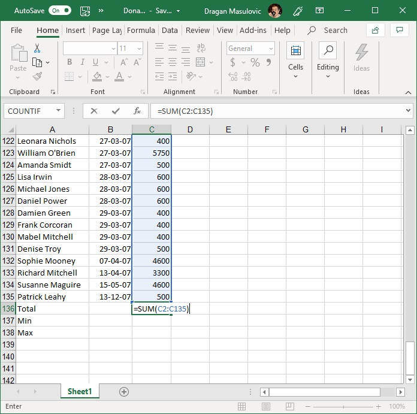

Потом у поље C137 унеси формулу
::

    =MIN(C2:C135)

а у поље C138 формулу
::

    =MАX(C2:C135)

како би добио вредност најмање и највеће донације:

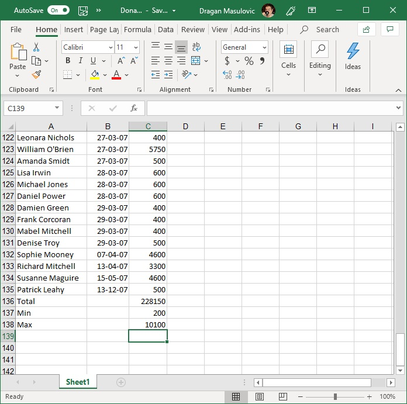

**Корак 5.** Пошто су све донације биле у еврима, форматираћемо све бројеве у колони C тако да се испред броја појави ознака за евро. Селектуј ћелије C2:C138

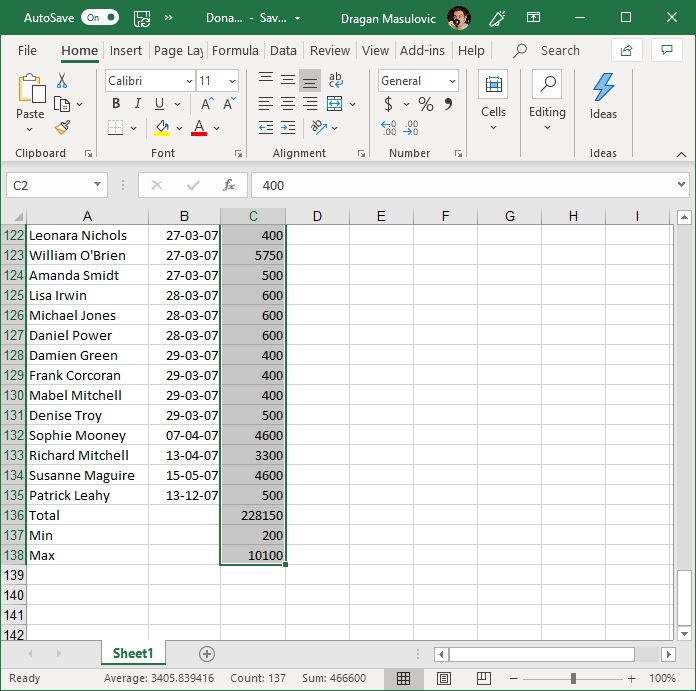

Кликни на стрелицу поред ознаке формата ћелије и појавиће се мали мени:

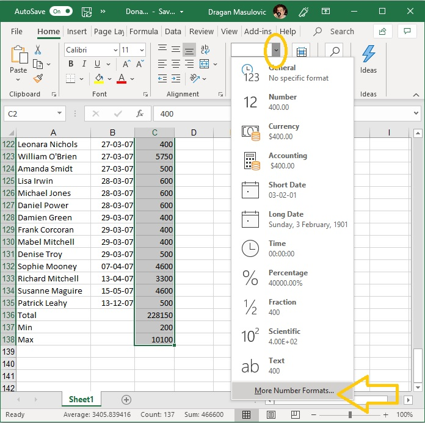

У њему постоји опција "Currency" (енгл. "валута", трећа од врха), али ако је одаберемо Ексел ће износе означити симболом за амерички долар. Зато ћемо да одаберемо "More Number Formats..." како је на горњој слици и предложено.

Добијамо нови дијалог:

.. image:: ../../_images/DataTypes308.jpg
   :width: 600px
   :align: center

У одељку "Category" (енгл. "Категорија") одаберемо "Currency" (енгл. "валута"). Ексел нам поново нуди симбол за амерички долар. Да бисмо променили симбол кликнемо на стрелицу која отвара избор расположивих симбола валута. Тако добијамо листу у којој потражимо симбол за евро (за ово треба стрпљења; симбол за евро уопште није близу врха):

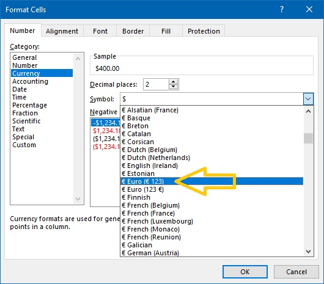

Одаберемо симбол за евро и кликнемо ОК:

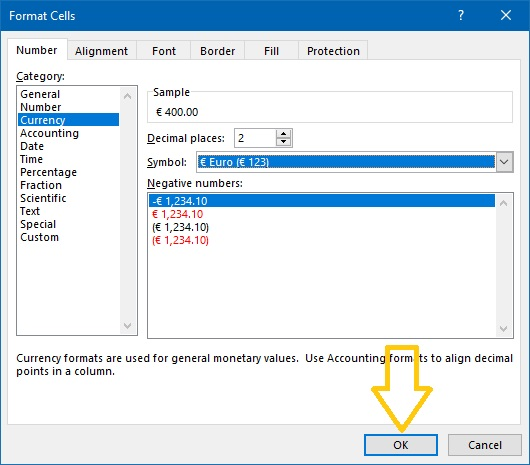

Табела сада изгледа овако:

.. image:: ../../_images/DataTypes311.jpg
   :width: 600px
   :align: center

**ШТА ЈЕ САД? ГДЕ СУ НЕСТАЛИ ИЗНОСИ У ВРСТИ "Total" И "Max"?**

Када у некој ћелији Ексел прикаже
::

    #############

то значи да се ту налази неки број, али је ћелија сувише уска да би тај број могао да буде приказан у целости. Само треба проширити колону C и све ће бити у реду:

.. image:: ../../_images/DataTypes312.jpg
   :width: 600px
   :align: center

**Корак 6.** Сними табелу за крај.

Пример: Музички фестивали у Европи -- датуми у Ексел табели
------------------------------------------------------------

У овом примеру ћемо направити табелу која представља списак неких музичких фестивала у Европи.

**Корак 1.** Покрени Ексел и направи празан документ:

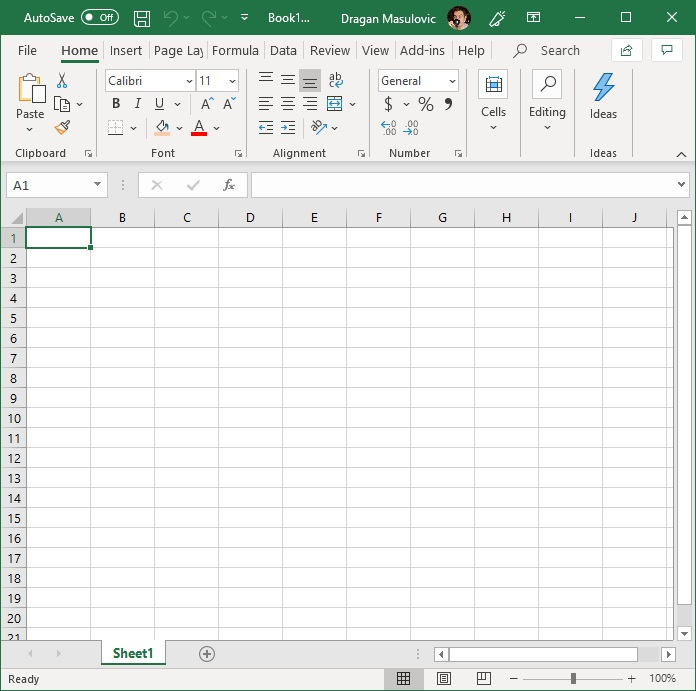

**Корак 2.** Прва врста ће представљати *заглавље табеле* и у ћелије чемо унети имена колона:

* Име фестивала
* Место одржавања
* Од дана
* До дана

Прошири колоне тако да имена колона буду видљива у целости:

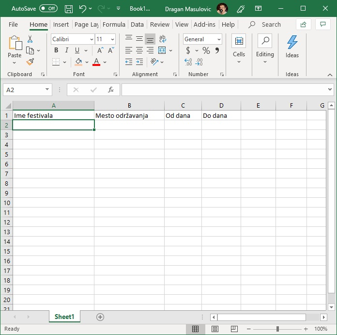

**Корак 3.** У табелу унеси податке које желиш. Ми ћемо у табелу унети податке о следећим фестивалима:

.. csv-table:: Музички фестивали
   :header: "Ime festivala", "Mesto održavanja", "Od dana", "Do dana"
   :align: left

   "Rock am Ring & Rock im Park", "Mendig i Nirnberg, Nemačka", "7.6.2019.", "9.6.2019."
   "Hellfest Open Air", "Klison, Francuska", "21.6.2019.", "23.6.2019."
   "Glastonbury", "Pilton, Velika Britanija", "26.6.2019.", "30.6.2019."
   "Defqon.1 Weekend Festival", "Bidinghujzen, Holandija", "28.6.2019.", "30.6.2019."
   "Roskilde", "Roskilde, Danska", "29.6.2019.", "6.7.2019."
   "EXIT Festival", "Novi Sad, Srbija", "4.7.2019.", "8.7.2019."
   "Lovebox", "London, Velika Britanija", "12.7.2019.", "13.7.2019."
   "Ultra Europe", "Split, Hrvatska", "12.7.2019.", "14.7.2019."
   "Super Bock Super Rock", "Lisabon, Portugal", "18.7.2019.", "20.7.2019."
   "Sziget Festival", "Budimpešta, Mađarska", "7.8.2019.", "13.8.2019."
   "Creamfields", "Dersberi, Velika Britanija", "22.8.2019.", "25.8.2019."

Име фестивала и место одржавања су обични текстови које лако уносимо. Датуме уносимо тако што у кућицу унесемо дан, месец и годину *раздвојене цртицама*. За први фестивал на нашем списку то су датуми:
::

    7-6-2019
    9-6-2019

Ексел ће препознати да су то датуми (енгл. *Date* значи "датум") и приказаће их као:
::

    07-06-19
    09-06-19

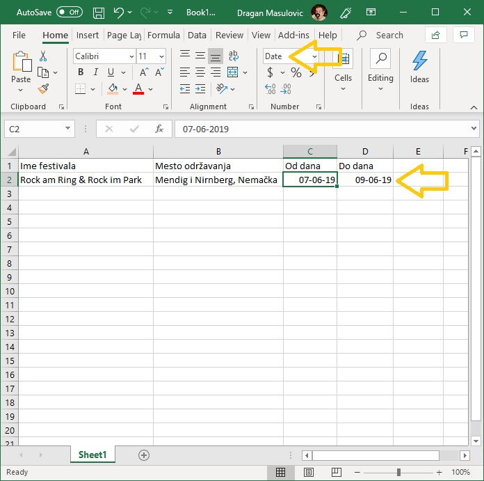

Унесимо податке о осталим фестивалима. У нашем примеру табела изгледа овако:

.. image:: ../../_images/DataTypes104.jpg
   :width: 600px
   :align: center

**Корак 4.** Сада ћемо да израчунамо колико дана траје сваки фестивал. У кућицу E1 ћемо уписати "Trajanje" (то је име нове колоне коју формирамо) и онда ћемо у кућицу E2 уписати формулу
::

    =D2-C2

.. image:: ../../_images/DataTypes105.jpg
   :width: 600px
   :align: center

**О, да! Ексел уме да рачуна са датумима!** Када притиснемо [ENTER] добијамо следеће стање:

.. image:: ../../_images/DataTypes106.jpg
   :width: 600px
   :align: center

Видимо да је за фестивал који се одржава 7.6, 8.6. и 9.6.2019. Ексел обрачунао да траје 2 дана. Разлог је у томе што се у пословном свету ова функција углавном користи за обрачун дневница (од 7.6. до 8.6. је једна дневница, и од 8.6. до 9.6. је друга дневница). Овај фестивал, с друге стране, траје три дана: цео 7.6, цео 8.6. и цео 9.6. Зато морамо да прилагодимо формулу нашој ситуацији и да унесемо:
::

    =D2-C2+1

.. image:: ../../_images/DataTypes107.jpg
   :width: 600px
   :align: center

Ако сада формулу брзо ископирамо наниже (кликнемо на ћелију Е2, ухватимо за "бубуљицу" и развучемо наниже) добијамо:

.. image:: ../../_images/DataTypes108.jpg
   :width: 600px
   :align: center

**Корак 5.** Снимићемо табелу под именом "MuzickiFestivali.xlsx"
Сада ћемо израчунати просечно трајање фестивала у табели, као и најкраће и најдуже фестивале у табели.

**Корак 6.** Додај табели три нова реда: "Prosek", "Najkraći" и "Najduži":

.. image:: ../../_images/DataTypes109.jpg
   :width: 600px
   :align: center

**Корак 7.** У одговарајућа поља колоне E унеси следеће формуле:
::

    =AVERAGE(E2:E12)
    =MIN(E2:E12)
    =MAX(E2:E12)

.. image:: ../../_images/DataTypes110.jpg
   :width: 600px
   :align: center

**Корак 8.** Поље које одговара просеку прикажи са две децимале:

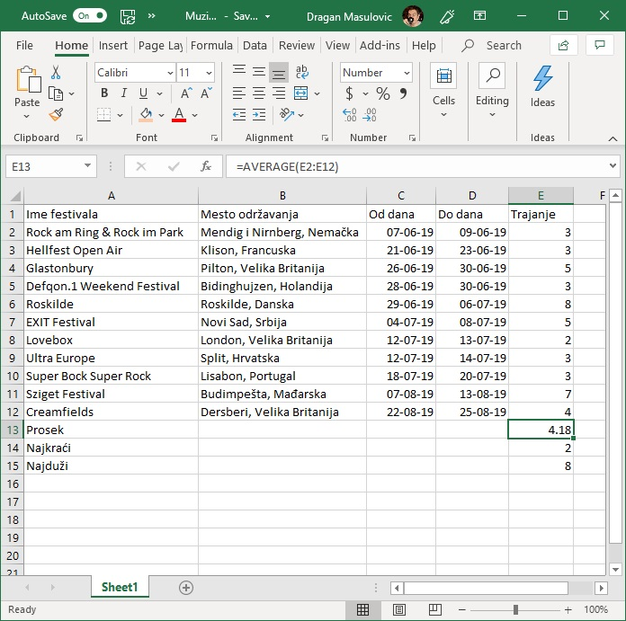

**Корак 9.** Једном бојом обој *све податке* о фестивалу који траје најкраће, а другом *све податке* о фестивалу који траје најдуже:

.. image:: ../../_images/DataTypes112.jpg
   :width: 600px
   :align: center

**Корак 10.** Постави стил слова у ћелијама A1:E1 на **bold** (кликни на **B**), а у ћелијама A13:E15 на *italic* (кликни на *I*):

.. image:: ../../_images/DataTypes113.jpg
   :width: 600px
   :align: center

**Корак 11.** Сада ћемо да подвучемо линију испод заглавља (прве врсте) и података о последњем фестивалу на списку (у нашем примеру то је дванаеста врста).

Селектуј ћелије А1:Е1

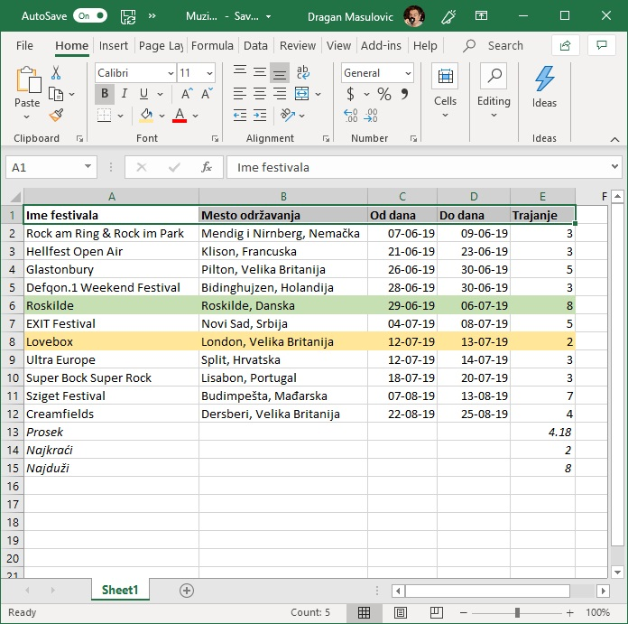

Онда кликни на стрелицу поред иконе за уоквиравање ћелија и одабери "Bottom Border":

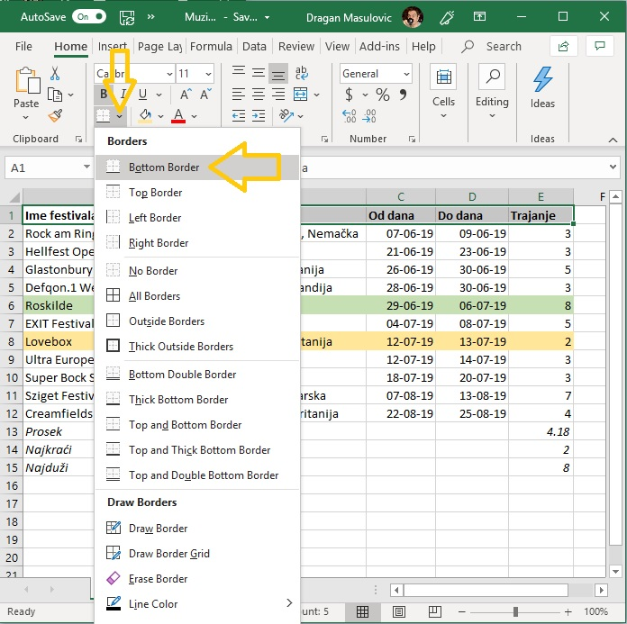

Исто то уради заврсту која садржи податке о последњем фестивалу у табели. Добијамо:

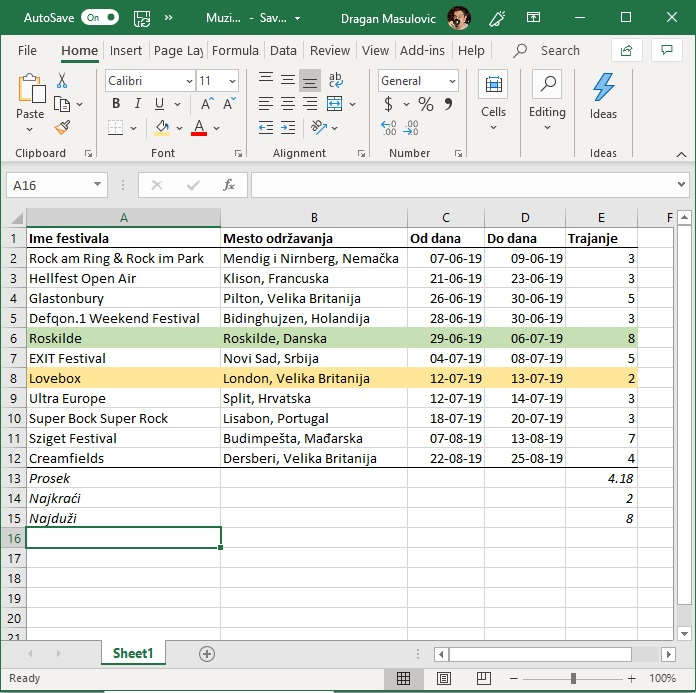

**Корак 12.** Још само једна естетска ситница и готови смо! Датуми одржавања фестивала и трајање фестивала су поравнати по десној ивици, док су имена одговарајућих колона (C, D и E) поравната по левој ивици. Поравнаћемо и њих по десној ивици, да нам табела буде лепша. Томе служе команде из групе "Alignment" (енгл. "поравнавање"):

.. image:: ../../_images/DataTypes117.jpg
   :width: 600px
   :align: center

Вертикално поравнавање садржаја ћелије може бити уз горњу ивицу, центрирано, или уз доњу ивицу. Хоризонтално поравнавање садржаја ћелије може бити уз леву ивицу, центрирано, или уз десну ивицу. (Команде "Wrap Text" и "Merge Cells" ћемо објаснити ускоро.)

Желимо да поравнамо садржај уз десну ивицу. Зато селектуј ћелије C1:E1 и одабери поравнавање уз десну ивицу:

.. image:: ../../_images/DataTypes119.jpg
   :width: 600px
   :align: center

Тако добијамо коначан изглед табеле:

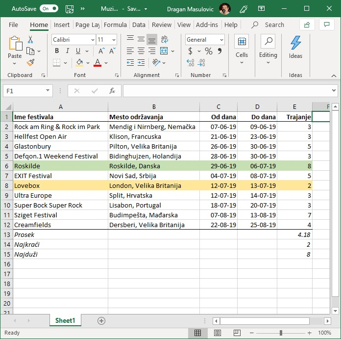

**Корак 13.** Сними табелу.

Пример: Плеј-листа -- време у Ексел табели
-------------------------------------------

Овако изгледа плеј-листа албума "re:member" популарног исландског музичара Olafurа Arnaldsа:

.. csv-table:: Плеј-листа албума "re:member" Olafurа Arnaldsа
   :header: "Rb", "Numera", "Trajanje"
   :align: left

   "1", "re:member", "6:04"
   "2", "unfold", "3:58"
   "3", "saman", "2:11"
   "4", "brot", "2:54"
   "5", "inconsist", "4:31"
   "6", "they sink", "2:35"
   "7", "ypsilon", "3:55"
   "8", "partial", "3:16"
   "9", "momentary", "2:05"
   "10", "undir", "6:30"
   "11", "ekki hugsa", "4:41"
   "12", "nyepi", "4:14"

Унећемо ове податке у Ексел и израчунати колико је укупно трајање албума.

**Корак 1.** Са следећег линка `Remember.xlsx <https://petljamediastorage.blob.core.windows.net/root/Media/Default/Kursevi/programiranje_II/epodaci/Remember.xlsx>`_ преузми датотеку која садржи имена нумера,
покрени Ексел и учитај датотеку:

.. image:: ../../_images/DataTypes201.jpg
   :width: 600px
   :align: center

**Корак 2.** За сваку од нумера унеси трајање. Податке који се односе на трајање (време) треба у Ексел да унесемо у облику
::

    hh:mm:ss

где *hh* означава сате, *mm* минуте, а *ss* секунде, раздвојено двотачкама. Увек морамо унети све три компоненте (и сате, и минуте и секунде), чак и ако је неки од њих 0. На пример, за прву нумеру ћемо унети
::

    0:6:4

што значи 0 сати, 6 минута и 4 секунде. Тако добијамо:

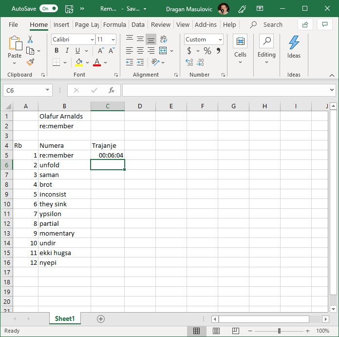

Унесимо сада на исти начин и трајање свих осталих нумера:

.. image:: ../../_images/DataTypes203.jpg
   :width: 600px
   :align: center

Ексел уме да рачуна са временима, па је лако одредити укупно трајање албума. У ћелију C2 ћемо уписати укупно трајање албума тако што ћемо унети формулу:
::

    =SUM(C5:C6)

.. image:: ../../_images/DataTypes204.jpg
   :width: 600px
   :align: center

Ексел је сабрао трајање свих нумера и у поље уписао трајање целог албума:

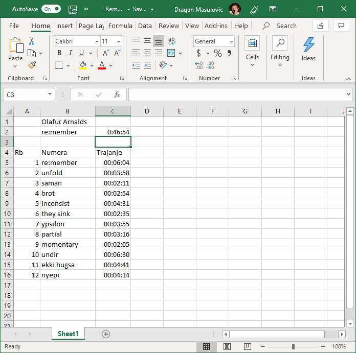

**Корак 3.** За крај ћемо мало улепшати табелу. Прво ћемо центрирати садржај у ћелијама A4:А16

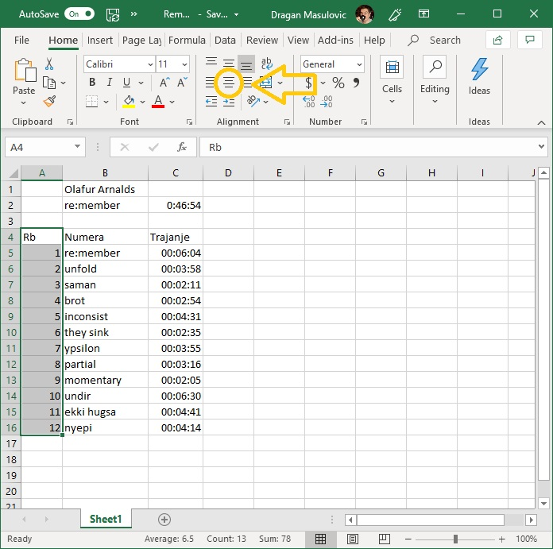

док ћемо ћелију C4 поравнати по десној ивици:

.. image:: ../../_images/DataTypes207.jpg
   :width: 600px
   :align: center

Позадину ћелија A1:C2 ћемо обојити црно, а слова бело. Исто тако и ћелије A4:C4

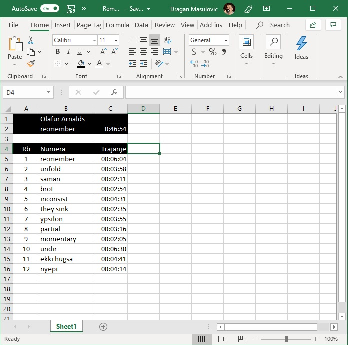

Стил слова у ћелији B1 (име аутора) ћемо поставити на *italic*, а у ћелијама B2:C2 (име албума и трајање) на **bold**. Коначно, ћелије A5:C16 ћемо обојити светло сиво:

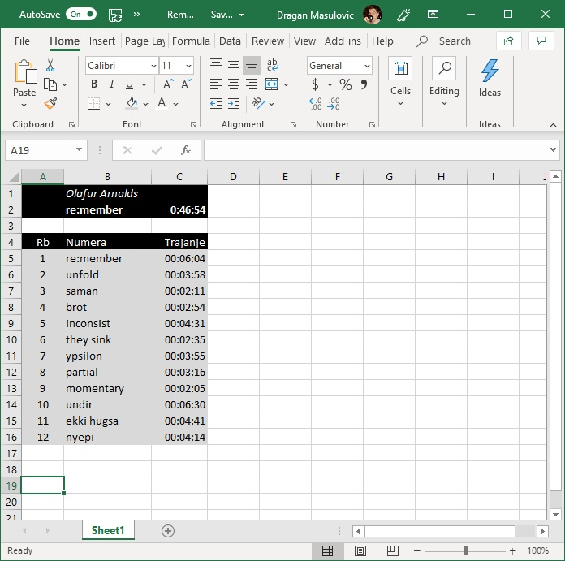

**Корак 4.** Сними табелу.

Задаци.
--------

**Задатак 1.** Направи Ексел табелу која садржи одсуствовања са наставе неког ученика. Табела треба да има три колоне:

* Od
* Do
* Dana

У колоне "Od" и "Do" унеси неколико података о одсуствима. Онда у колони "Dana" израчунај колико је трајало свако одсуство. Користи формулу као што је ова:
::

    =B2-A2+1

У последњи ред табеле у колону "Od" упиши "Ukupno" и онда у колони "Dana" израчунај колико си укупно одсуствовање корисећи формулу сличну овој:
::

    =SUM(C2:C7)

Улепшај табелу и сними је. Табела на крају треба да изгледа отприлике овако:

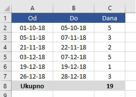

**Задатак 2.** Направи Ексел табелу која садржи дневник рада једног ученика. Табела треба да има следеће колоне:

* Datum
* Početak učenja
* Kraj učenja
* Trajanje

У табелу унеси податке о томе када је ученик почео да учи и када је завршио учење за неколико дана. Онда за сваки дан израчунај колико времена је провео учећи. На крају табеле додај табели редове који се зову

* Prosečno
* Min
* Max

па израчунај колико је тај ученик учио у просеку, колико је најмање времена провео учећи, а колико највише. Улепшај табелу и сними је.

Табела коју добијеш треба да изгледа отприлике овако:

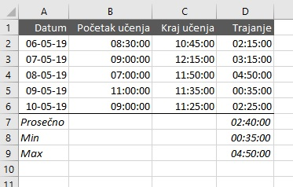

**Задатак 3*.** Направи Ексел табелу која садржи распоред излагања презентација из неког предмета. Табела треба да има три колоне:

* Učenik
* Naslov prezentacije
* Od
* Do

Први ученик креће са излагањем у 9:05. Сваки ученик има 12 минута за излагање презентације, и предвиђено је 4 минута паузе између два излагања. Ако знаш када је ученик почео са излагањем, крај излагања ћеш добити тако што ћеш, на пример у ћелију D2 унети формулу:
::

    =C2+TIME(0,12,0)

Ова формула на садржај ћелије C2 (почетак излагања) додаје *време* (енгл. TIME) у трајању од 0 сати, 12 минута и 0 секунди.

Да би се аутоматски израчунао почетак наредног излагања на крај последњег излагања треба додати 4 минута. На пример, у ћелију C3 треба унети формулу:
::

    =D2+TIME(0,4,0)

(Можеш да "развучеш наниже" формуле у обе колоне како би брзо попунио табелу.)

Пошто нам у овом примеру секунде нису битне, форматирај ћелије које садрже време тако да се приказују само сати и минути како следи. Селектуј ћелије које садрже време почетка и краја сваког излагања, кликни на стрелицу поред ћелије која описује формат, па одабери "More Number Formats":

.. image:: ../../_images/DataTypes211.jpg
   :width: 600px
   :align: center

У листи "Category" одабери "Time", па онда у листи "Type" одабери "13:30", што представља пример формата:

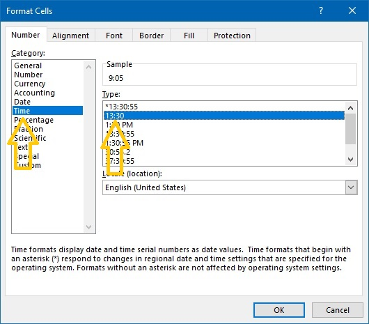

Улепшај табелу и сними је. Табела на крају треба да изгледа отприлике овако:

.. image:: ../../_images/DataTypes213.jpg
   :width: 600px
   :align: center

