Штампање и генерисање ПДФ документа
====================================

Теме овог часа су:

1. приказивање броја у облику процента,
2. рад са ћелијама табеле (приказивање веће количине текста у ћелији, спајање ћелија)
3. штампање документа
4. генерисање ПДФ документа

Пример: Реке Србије -- проценти и рад са ћелијама табеле
---------------------------------------------------------

**Корак 1.** Са следећег линка `RekeSrbije.xlsx <https://petljamediastorage.blob.core.windows.net/root/Media/Default/Kursevi/programiranje_II/epodaci/RekeSrbije.xlsx>`_
преузми документ *RekeSrbije.xlsx* која садржи податке о најдужим рекама у Србији и сними га на свој рачунар.

Покрени Ексел и отвори документ:

.. image:: ../../_images/Print1.jpg
   :width: 600px
   :align: center

Проширивање врсте и приказивање садржаја ћелије у више редова
--------------------------------------------------------------

**Корак 2.** Прошири колоне тако да се у потпуности види садржај ћелија:

.. image:: ../../_images/Print2.jpg
   :width: 600px
   :align: center

Табела је ружна зато што је, рецимо, име колоне C дугачко, а бројеви који су уписани у ту колону су релативно мали. Има много празног простора и то отежава читање.

Зато ћемо табелу форматирати другачије.

**Корак 3.** Сузи колоне B и C и прошири прву врсту. Да бу проширио прву врсту "ухвати" мишем границу између бројева ``1`` и ``2``

.. image:: ../../_images/Print3.jpg
   :width: 600px
   :align: center

и повуци наниже:

.. image:: ../../_images/Print4.jpg
   :width: 600px
   :align: center

И даље се текст не види у целости: Ексел, наиме, неће сам од себе "смотати текст" у два реда чак и када је ћелија довољно висока. Морамо му наредити да то уради. Селектуј ћелије B1 и C1, па онда кликни на икону која одговара операцији "Wrap Text" (енгл. "смотај текст"):

.. image:: ../../_images/Print5.jpg
   :width: 600px
   :align: center

Табела сада изгледа овако:

.. image:: ../../_images/Print6.jpg
   :width: 600px
   :align: center

Приказивање бројева  у облику процента
---------------------------------------

**Корак 4.** Сада ћемо за сваку од река на списку израчунати који проценат њеног тока пролази кроз Србију. Да се подсетимо: реч *проценaт* потиче од латинског *pro centum* што значи "у стотини". Зато је

.. math::
     47\% = \frac{47}{100} = \text{четрдесет седам од сто}.

На пример, у једној школи која има 856 ученика њих 25% су одлични. Колико има одличних ученика у тој школи?

*Одговор.* У тој школи има 214 одличних ученика јер је

.. math::
     856 \cdot 25\% = 856 \cdot \frac{25}{100} = 214.

Дунав је дугачак 2850 км, од чега 588 км протиче кроз Србију. Који проценат свог тока Дунав проводи у Србији?

*Одговор.* Нека је то :math:`x\%`. Онда је

.. math::
     2850 \cdot x\% = 2850 \cdot \frac{x}{100} = 588.

Одатле се лако добија да је

.. math::
     x = \frac{588 \cdot 100}{2850} \approx 20,63\%

Дакле, приближно :math:`20,63\%` свог тока Дунав проводи у Србији.

Проценат, дакле, представља количник дела и целине, помножен са 100. Да бисмо у Екселу израчунали проценте, довољно је израчунати количник дела и целине, и тако добијене бројеве *форматирати као проценат*.

Да кренемо са послом. У ћелију D2 унесемо формулу
::

    =C2/B2

што значи да рачунамо количник дела и целине (*удео* тока кроз Србију у целом току Дунава):

.. image:: ../../_images/Print7.jpg
   :width: 600px
   :align: center

Исто урадимо и за остале реке у табели. Добијамо:

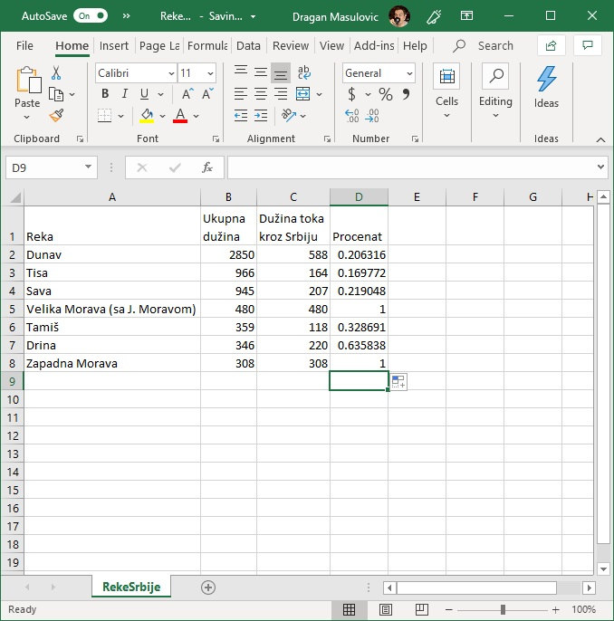

Да бисмо ове количнике приказали као проценте селектоваћемо ћелије D2:D8, кликнути на стрелицу поред формата податка и одабрати "Percentage":

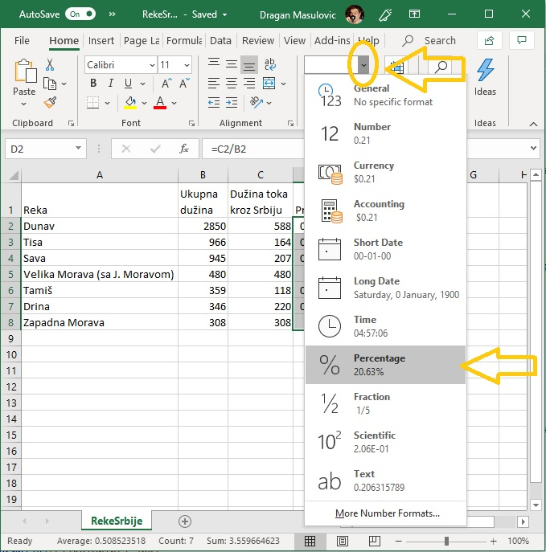

Добијамо количнике форматиране као проценте, на две децимале:

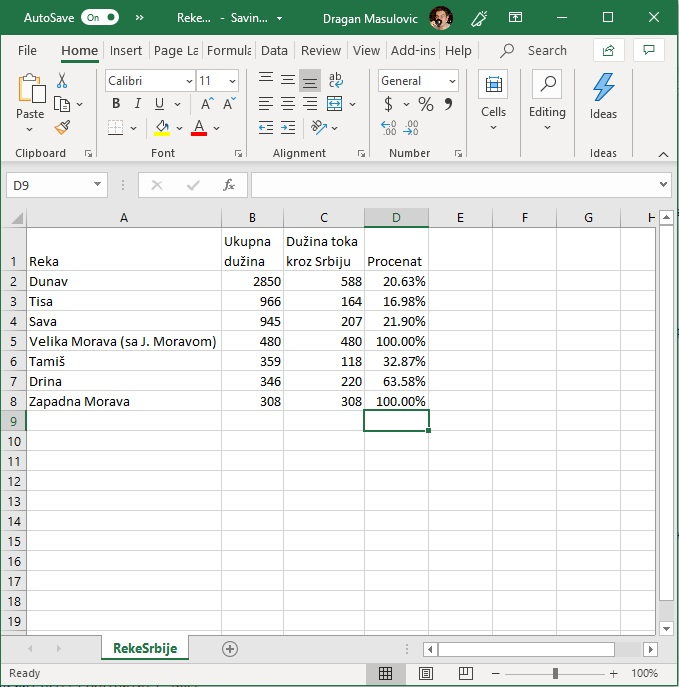

Спајање ћелија и промена величине слова
----------------------------------------

**Корак 5.** У овом кораку ћемо табели додати наслов "Najduže reke Srbije". Како у табели нема места за наслов, убацићемо празну врсту пре прве врсте табеле.

Кликни *десним* тастером миша на број ``1`` (редни број прве врсте), па у малом менију који се појавио одабери "Insert":

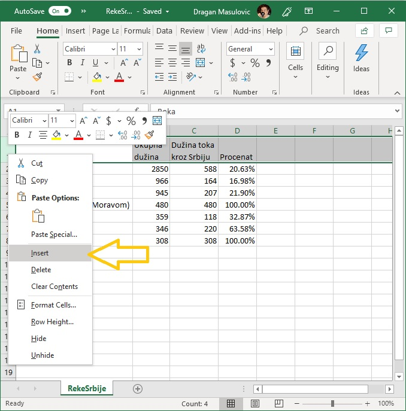

Испред прве врсте се појавила нова, празна врста:

.. image:: ../../_images/Print12.jpg
   :width: 600px
   :align: center

Пошто желимо да додамо наслов за *целу табелу* спојићемо ћелије A1, B1, C1 и D1 у *једну велику ћелију*. Селектуј ћелије A1:D1 и кликни на икону која представља операцију "Merge Cells" (енгл. "спој ћелије"):

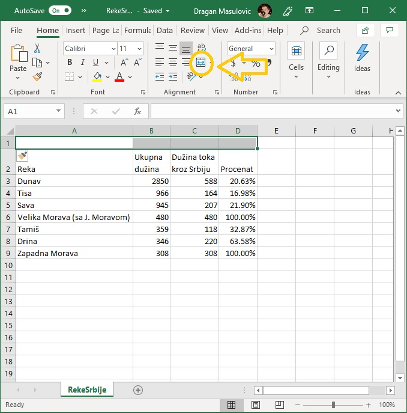

Добијамо:

.. image:: ../../_images/Print14.jpg
   :width: 600px
   :align: center

У нову, велику ћелију унеси текст "Najduže reke Srbije" (без наводника, наравно!):

.. image:: ../../_images/Print15.jpg
   :width: 600px
   :align: center

**Корак 6.** Сада ћемо мало уредити табелу. Повећај фонт наслова табеле, као стил одабери **bold** (ако затреба, прошири прву врсту):

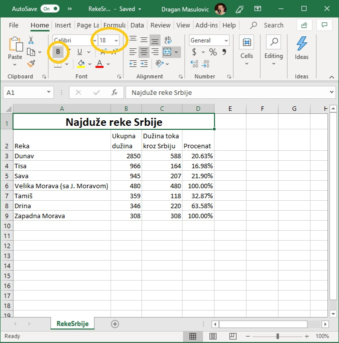

**Корак 7.** Ћелије B2, C2, D2 поравнај по десној ивици:

.. image:: ../../_images/Print17.jpg
   :width: 600px
   :align: center

**Корак 8.** За ћелије А2:D2 одабери стил *italic* и центрирај њихов садржај *вертикално*:

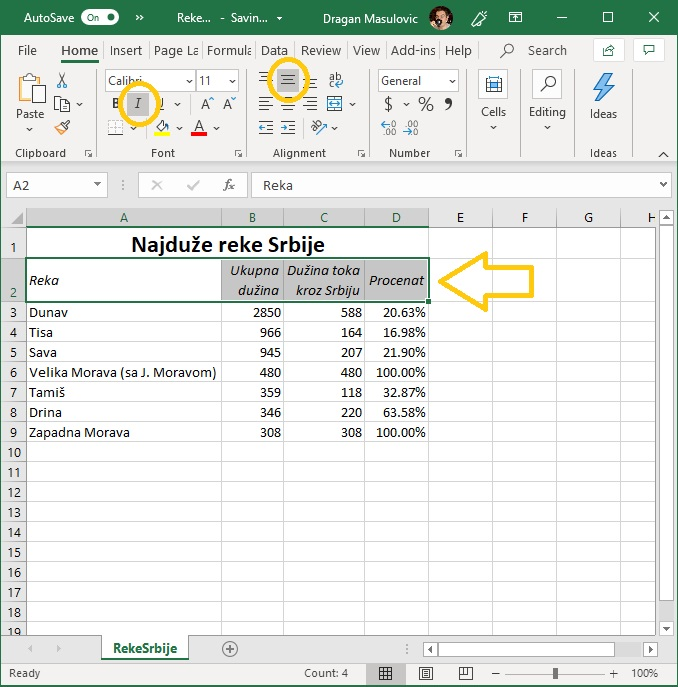

**Корак 9.** на крају ћемо поставити оквир око табеле. Селектуј ћелије A2:D9 и из менија са оквирима одабери опцију "All Borders":

.. image:: ../../_images/Print19.jpg
   :width: 600px
   :align: center

Табела изгледа овако:

.. image:: ../../_images/Print20.jpg
   :width: 600px
   :align: center

Сними је.

Штампање документа
-------------------

Иако живимо у 21. веку, папирни документи и даље представљају незаобилазан сегмент пословне реалности. Зато сваки програм за уређивање текста, табела итд има могућност да одштампа документ.

**Корак 10.** Да бисмо одштампали табелу треба прво да кликнемо на "File":

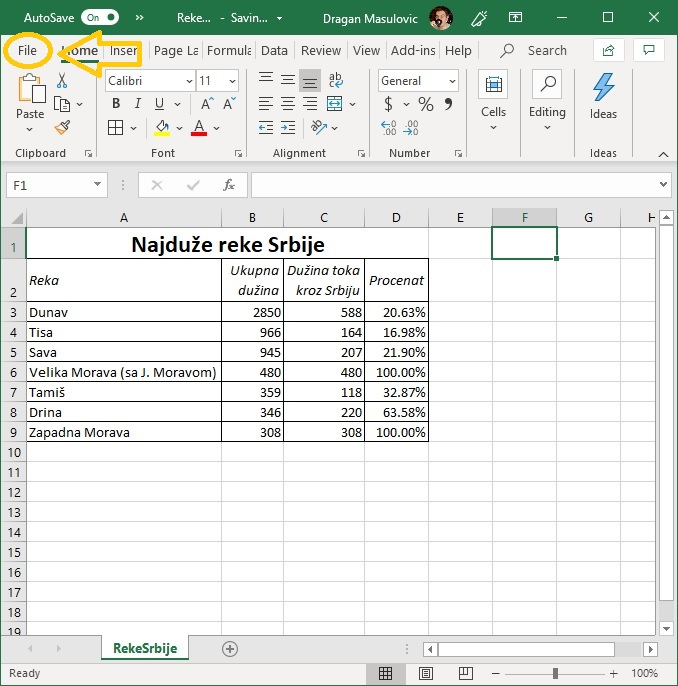

и у новом погледу који смо добили треба да кликнемо на "Print":

.. image:: ../../_images/Print23.jpg
   :width: 600px
   :align: center

Тако долазимо до менија за штампање:

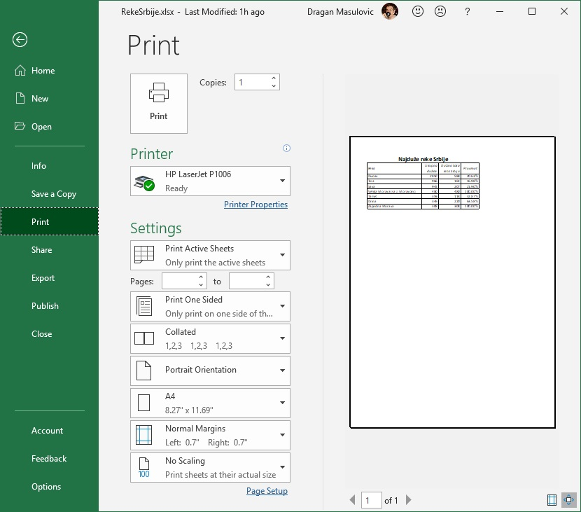

Са десне стране нам је приказан преглед документа: тако ће документ изгледати када се одштампа. Кликом на дугме "Print" документ шаљемо на штампу:

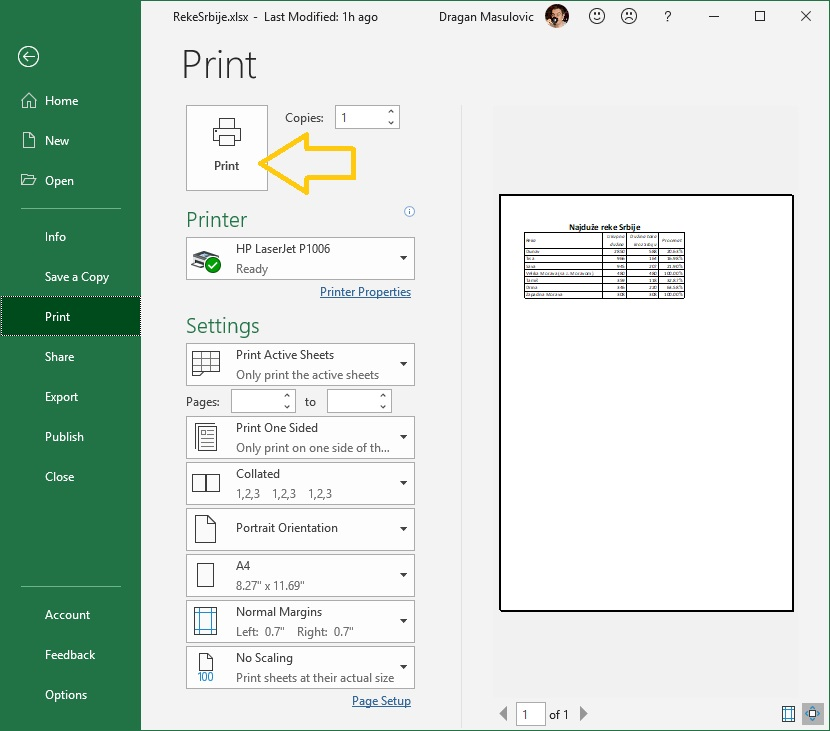

Овај документ ће бити одштампан у једном примерку ("Copies: 1") на штампачу који се подразумева. Лако можемо да променимо број примерака или да документ пошаљемо на други штампач:

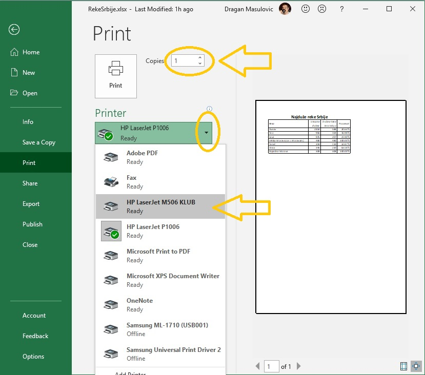

У делу менија који се зове "Settings" можемо да мењамо разне параметре штампе (маргине, оријентацију папира итд), а ми ћемо детаљно причати само о једном -- параметру који одређује формат папира:

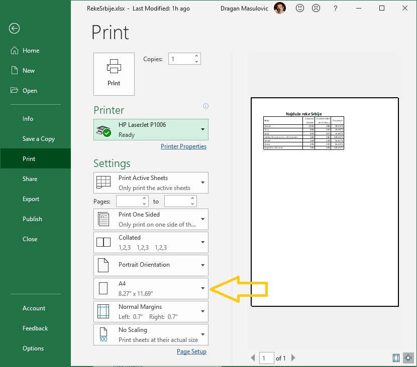

Стандардни формат папира за штампање у Европи, па и у Србији као држави европског културног простора, се зове А4. Његове димензије су 210мм x 297мм. (Ако те занима зашто се баш тако зове и зашто су баш те димензије потражи на интернету "формати папира" или "ДИН А формат"). С друге стране, у Северној Америци, одакле нам долазе сви програми, стандардни формат за штампање се зове "Letter" и његове димензије су 8,5" x 11" (што је 215,9 мм x 279,4 мм). Дакле, формат "Letter" је дежмекастији -- мало је нижи и мало шири:

.. image:: ../../_images/A4-Letter.jpg
   :width: 600px
   :align: center

Често се дешава да су након инсталације софтвера параметри подешени према америчком стандарду. Уколико је то случај, треба променити формат папира. Довољно је кликнути на стрелицу поред имена формата и одабрати жељени формат:

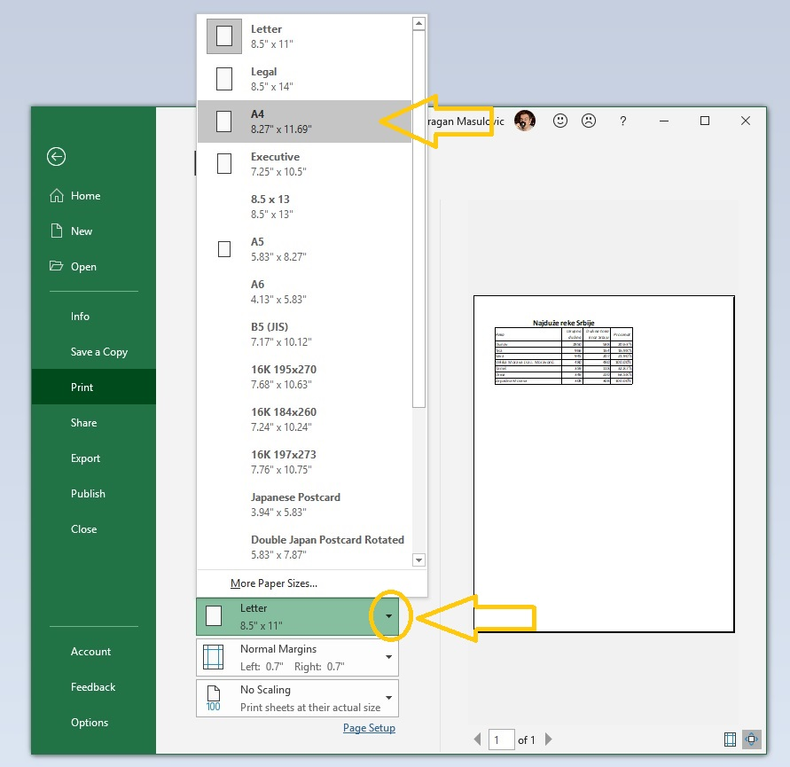

Снимање документа у ПДФ формату
--------------------------------

ПДФ (PDF) је скраћеница од *Protable Document Format*, што значи "преносни формат за документе". Он омогућује да се документ који је направљен на једном рачунару отвори, чита и штампа на *било ком другом рачунару* независно од произвођача рачунара, независно од оперативног система под којим рачунар ради, и независно од тога колико је стар рачунар.

На пример, документ направљен на персоналном рачунару (PC) који ради под оперативним системом *Windows 10* може да се отвори и прочита на рачунару који ради под оперативним системом *Linux*, или на лаптопу који ради под оперативним системом *macOS*, или на мобилном телефону који ради под оперативним системом *Android*, или на таблет рачунару који ради под оперативним системом *iOS*. И обрнуто: ПДФ документ који је направљен на таблет рачунару који ради под оперативним системом *iOS* може без проблема да се прочита и одштампа на персоналном рачунару који ради под оперативним системом *Windows 10*.

Цена коју плаћамо за универзалност ПДФ формата је чињеница да ПДФ документ *не може да се мења!* Зато је веома важно запамтити следеће: ако сте ПДФ документ направили од неког другог документа, рецимо од Ексел табеле, *увек морате сачувати и полазни документ (Ексел табелу)!* Ексел не може да учита ПДФ документ и да на њему врши измене. Ако је потребно нешто променити, измене извршимо у оригиналном документу, рецимо Ексел табели, и онда поново од њега направимо ПДФ.

И поред овог ограничења, ПДФ је данас постао *de facto* стандард за размену докумената. Ако некоме треба да пошаљете неке документе, а није унапред договорено  у ком формату се шаљу документи, принципи *дигиталне етикеције* налажу да се у том случају шаље *искључиво ПДФ* верзија документа. Разлог је једноставан: да би неко могао да прочита, рецимо, Ексел фајл, мора да купи одговарајући софтвер. За ПДФ, међутим, постоје *бесплатни* читачи за све врсте дигиталних уређаја које су икада направљене.

Да бисмо претходни документ снимили у ПДФ формату треба да кликнемо на "File":

.. image:: ../../_images/Print29.jpg
   :width: 600px
   :align: center

потом одаберемо "Save a copy" (енгл. "сачувај копију"):

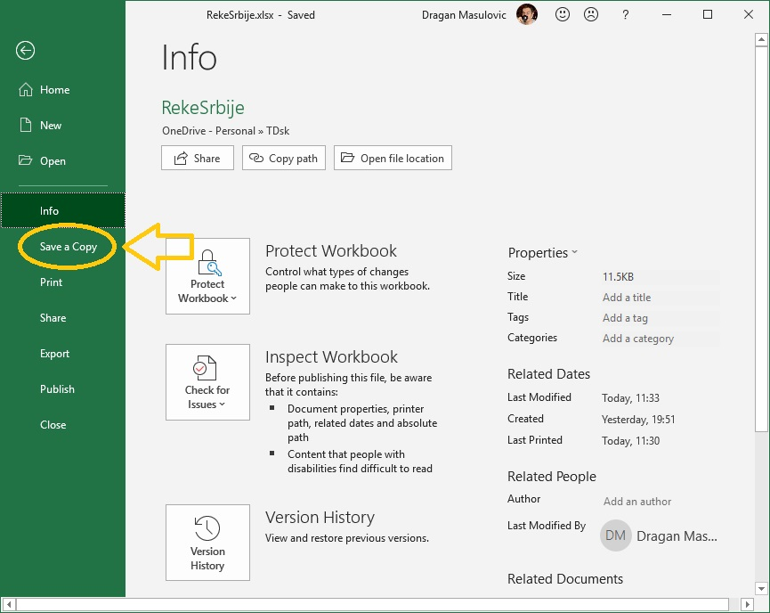

онда кликнемо на стрелицу поред формата документа како бисмо добили (огромну!) листу свих расположивих формата које Ексел подржава, и одаберемо формат ПДФ:

.. image:: ../../_images/Print31.jpg
   :width: 600px
   :align: center

На крају кликнемо на "Save":

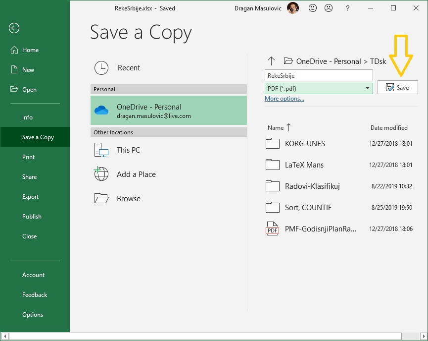

Ако ПДФ документ отворимо из неког програма за преглед ПДФ докумената видећемо нешто слично овоме:

.. image:: ../../_images/Print33.jpg
   :width: 600px
   :align: center

Задаци
-------

**Задатак 1.** Са следећег линка
`Remember.xlsx <https://petljamediastorage.blob.core.windows.net/root/Media/Default/Kursevi/programiranje_II/epodaci/Remember.xlsx>`_
преузми датотеку која садржи (будућу) плеј-листу.

За сваку нумеру унеси трајање и одреди укупно трајање плеј-листе. Улепшај табелу и сними је као Ексел фајл и као ПДФ фајл.

**Задатак 2.** Са следећег линка
`StanovnistvoSrbije2017.xlsx <https://petljamediastorage.blob.core.windows.net/root/Media/Default/Kursevi/programiranje_II/epodaci/StanovnistvoSrbije2017.xlsx>`_
преузми датотеку која садржи податке о броју становника Србије у 2017. години по годинама старости.

Додај табели три колоне:

* Ukupno
* Procenat M
* Procenat Ž

У свакој врсти табеле (дакле, за сваки узраст за који у табели постоје подаци) одреди укупан број становника тог узраста, као и проценат припадника мушког и женског пола.

Улепшај табелу и сними је као Ексел фајл и као ПДФ фајл.
