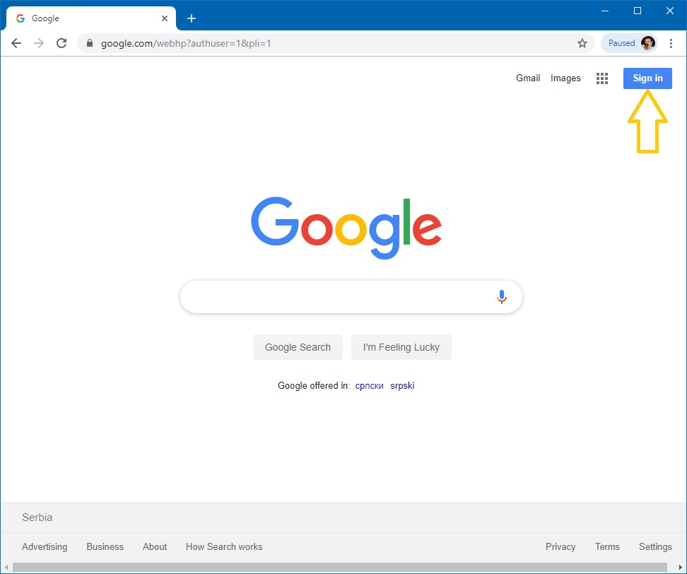
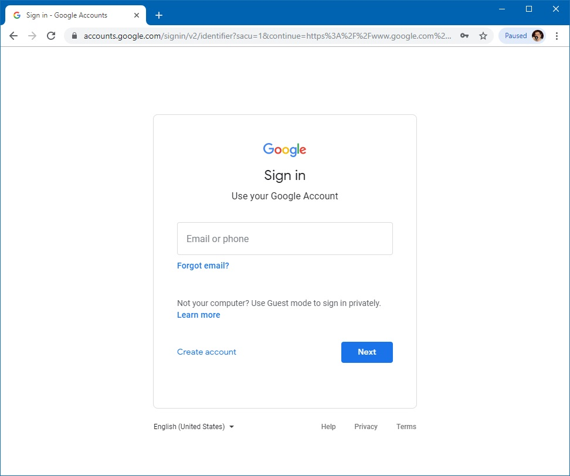
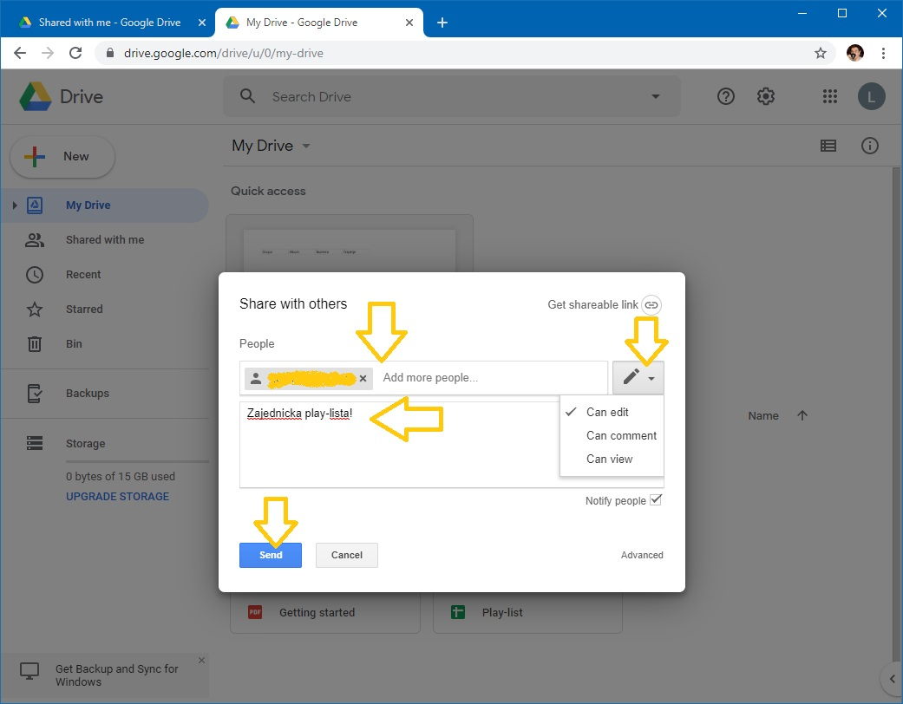
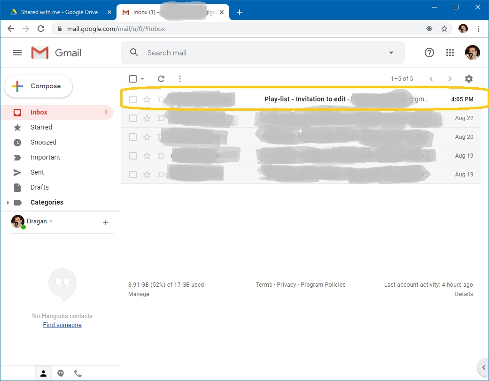
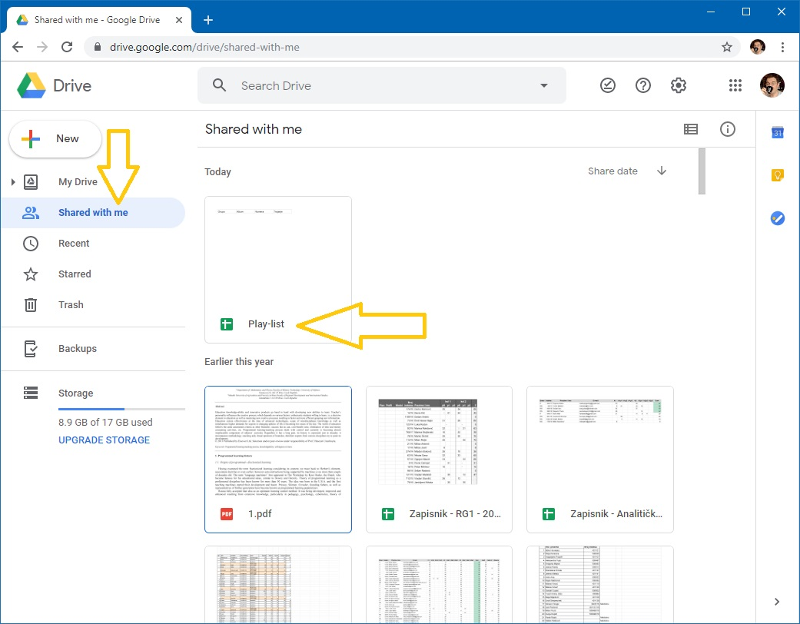
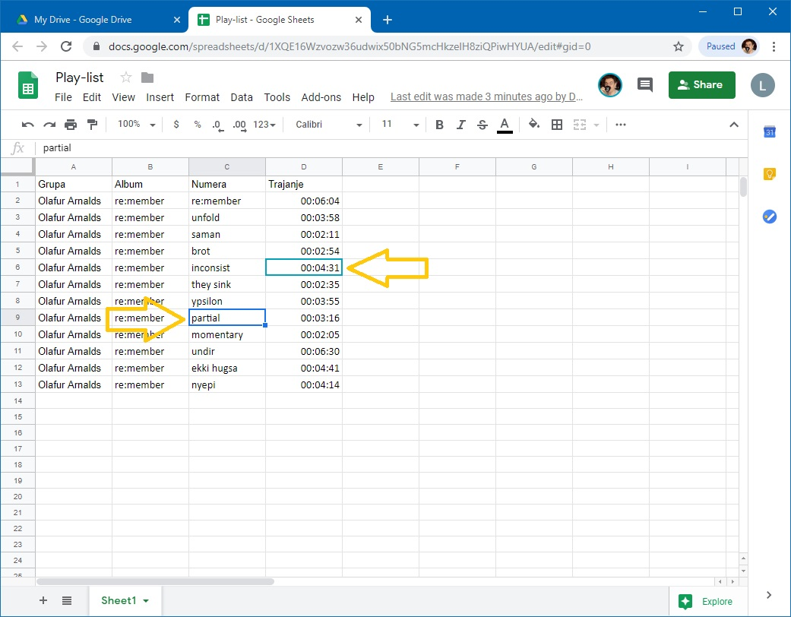
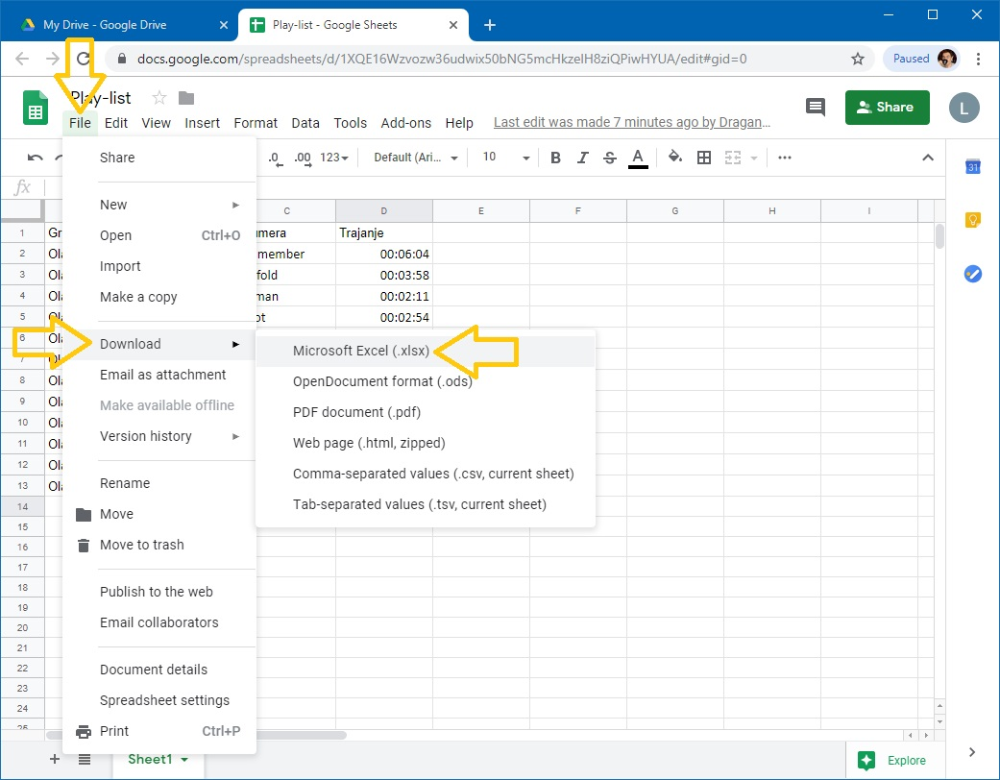

Рад са дељеним табелама
=======================

У овој лекцији се бавимо подацима "у облаку". Причаћемо о:

1. сервисима "у облаку",
2. креирању документа "у облаку",
3. дељењу документа "у облаку" са сарадницима,
4. преузимању документа

Сервиси у облаку (*cloud services*)
------------------------------------

Огромна брзина протока информација кроз Интернет је омогућила брз и једноставан приступ удаљеним подацима, а потом и развој *сервиса "у облаку"* (*cloud services*). Сервис "у облаку" је програм који се извршава на удаљеном рачунару и кога користимо преко Интернета. Типичан пример сервиса "у облаку" кога користимо скоро сваки дан је *веб мејл* (*web mail*), што представља систем за слање и примање електронске поште где се и програм преко кога шаљемо и примамо електронску пошту, као и подаци (електронска писма) налазе на удаљеном рачунару чији задатак је да опслужује кориснике веб сервиса. Зато се такви удаљени рачунари називају *сервери*.

Данас на располагању имамо на хиљаде разних сервиса "у облаку" који се крећу од обичног чувања докумената, преко могућности да групе корисника сарађују на обради докумената "у облаку", па чак до изнајмљивање процесорског времена.

.. image:: ../../_images/Sh1.jpg
   :width: 600px
   :align: center

На пример, компанија Google за своје кориснике нуди

* Google Mail - електонска пошта "у облаку"
* Google Drive - сервис за складиштење докумената "у облаку"
* Google Docs, Sheets, Slides - сервис за креирање и уређивање текстова, табела и презентација "у облаку".

Слично томе, компанија Microsoft за своје кориснике нуди

* Outlook - електонска пошта "у облаку"
* OneDrive - сервис за складиштење докумената "у облаку"
* Word, Excel, PowerPoint - сервис за креирање и уређивање текстова, табела и презентација "у облаку"
* Azure - сервис за извршавање апликација (програма) у облаку.

Наравно, Google и Microsoft нису једине компаније које нуде сервисе у облаку.

Циљ ове лекције је да покажемо како се користе сервиси "у облаку" за рад са табелама за унакрсна израчунавања, са освртом на могућност да више корисника у исто време ради на једном документу (*колаборација*). Определили смо се за Google-ове сервисе зато што су бесплатни и зато што верујемо да већина ученика у Србији већ поседује кориснички налог код Google-а због популарности паметних телефона базираних на Андроиду.
Google-ове сервисе могу да користе само регистровани корисници. Да бисмо приступили сервисима треба прво да се пријавимо. Треба отићи на *google.com*, кликнути на *Sign In* (енгл. "пријави се")

и потом унети своју адресу за електронску пошту и одговарајућу лозинку:

Након идентификације имамо приступ свим Google-овим сервисима.

Креирање документа "у облаку"
------------------------------

**Корак 1.** Отићи ћемо на *drive.google.com*, што је комбиновани сервис за смештање података "у облаку", као и за креирање нових докумената "у облаку". Добијамо приказ докумената које смо до сада похранили на овом сервису (тренутно нема ниједног), као и могућност да креирамо нове документе.

.. image:: ../../_images/Sh4.jpg
   :width: 600px
   :align: center

**Корак 2.** Нови документ се креира кликом на "New", након чега имамо могућност да одаберемо врсту документа коју желимо да креирамо. Ми ћемо се определити за "Google Sheets" -> "Blank spreadsheet":

.. image:: ../../_images/Sh5.jpg
   :width: 600px
   :align: center

што је празна табела за унакрсна израчунавања:

.. image:: ../../_images/Sh6.jpg
   :width: 600px
   :align: center

Организација радне површине веома личи на Ексел и већина елемената би требало да ти је разумљива.

Као пример, направићемо плеј-листу која има следеће колоне:

* Grupa
* Album
* Numera
* Trajanje

До сада већ свако зна да унесе податке у табелу, па би просто пуњење табеле подацима било бескрајно досадно. Да бисмо ствари учинили интересантнијим показаћемо како може више корисника да ради на истом документу.

**Корак 3.** Поделите се у мање групе. Нека *један од чланова групе* направи овакву табелу:

.. image:: ../../_images/Sh8.jpg
   :width: 600px
   :align: center

**Корак 4.** Табела се тренутно зове "Untitled spreadsheet". Преименоваћемо је у "Play-list". Кликни на име табеле "Untitled spreadsheet":

.. image:: ../../_images/Sh9.jpg
   :width: 600px
   :align: center

па у оквир који се појавио унеси "Play-list" *без наводника*

.. image:: ../../_images/Sh10.jpg
   :width: 600px
   :align: center

и притисни [ENTER].

При раду са документима "у облаку" *нема опције "Save"* која снима документ. Свака измена у документу се одмах прослеђује серверу. *Довољно је само затворити таб у прегледачу*:

.. image:: ../../_images/Sh11.jpg
   :width: 600px
   :align: center

Нови документ са именом "Play-list" се појавио на списку докумената који су ускладиштени:

.. image:: ../../_images/Sh12.jpg
   :width: 600px
   :align: center

Дељење документа "у облаку" и колаборација
-------------------------------------------

**Корак 5.** Сада ћемо поделити документ са другим корисницима. Кликни *десним* тастером миша на документ и из менија који се појавио одабери "Share":

.. image:: ../../_images/Sh13.jpg
   :width: 600px
   :align: center

Појавиће се овакав дијалог:

У правоугаоник "People" треба унети email адресе колега са којима ће табела бити подељена.

Потом треба кликнути на оловчицу како би се одредио начин на који ће документ бити подељен:

* "Can edit" омогућује свима у групи да уносе податке у документ и да их мењају;
* "Can comment" омогућује свима у групи да додају коментаре у документ, али само власник документа (онај ко га је креирао) може да га мења;
* "Can view" омогућује свима у групи да виде документ, али само власник документа (онај ко га је креирао) може да га мења.

Можемо додати и кратак опис.

Коначно треба кликнути на [Send] ("пошаљи").

**Корак 6.** Сви чланови групе ће добити обавештење путем електронске поште да је документ подељен са њима:

Да би прихватили позив треба да отворе поруку и кликну на "Open in Sheets":

.. image:: ../../_images/Sh16.jpg
   :width: 600px
   :align: center

Ако сте сачували поруку којом сте обавештени да је документ подељен са вама у сваком тренутку можете доћи до документа тако што ћете отворити поруку и кликнути на "Open in Sheets". Друга могућност је да погледате списак свих докумената који су са вама подељени ("Shared with me"). Документ се налази и тамо:

Док више корисника ради на истом документу, свако има своју активну ћелију и тако се може пратити колико људи ради на документу и шта ко ради:

Преузимање документа
---------------------

Као што смо већ рекли, при раду са документима "у облаку" *нема опције "Save"* која снима документ. Свака измена у документу се одмах прослеђује серверу. Када завршимо рад на документу можемо га преузети и снимити на свој рачунар: треба кликнути на "File", ту одабрати "Download" па из подменија "Microsoft Excel (.xlsx)":

Одговарајући Ексел фајл ће бити преузет са сервера.

Важно је да разумемо да *измене које вршимо на копији фајла који се налази на нашем рачунару неће бити видљиве осталим члановима тима!* Само измене које вршимо "у облаку" ће бити доступне свима.

Задаци
-------

**Задатак 1.** Направити дељену табелу која садржи оцене свих ученика у групи. Један ученик у групи треба да направи табелу  и да подели табелу са осталим ученицима у групи. Онда сваки ученик нека унесе у табелу своје име, оцене и нека за себе израчуна просек оцена.

**Задатак 2.** Са следећег линка преузети документ *PoslJedinice.xlsx*

`PoslJedinice.xlsx <https://petljamediastorage.blob.core.windows.net/root/Media/Default/Kursevi/programiranje_II/epodaci/PoslJedinice.xlsx>`_

Нека један ученик у групи направи дељену табелу по угледу на ову, али нека унесе само радне листове "Cene" и "Pregled", па нека је подели са осталим ученицима у групи. Сваки ученик, потом, нека дода по један радни лист на коме ће описати зараду у својој пословној јединици, па после тога нека на радни лист "Pregled" дода податке о заради своје пословне јединице. Ученик који је креирао табелу на крају треба да израчуна укупну зараду.
