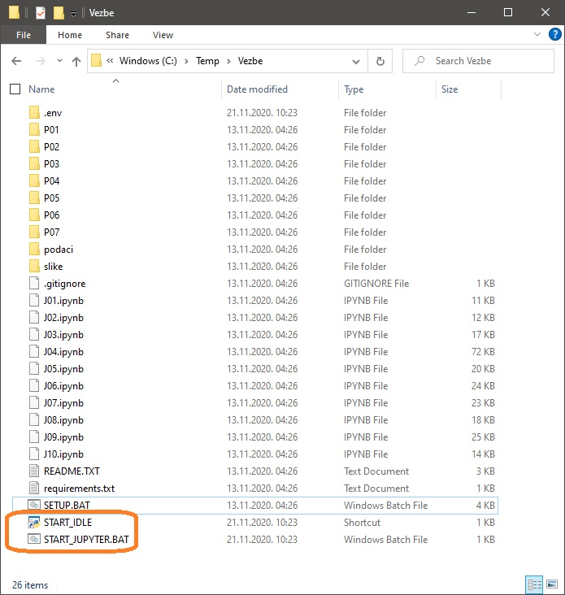

Покретање Џупитер (*Jupyter*) радних свески
============================================

Сада ћемо продискутовати неколико начина да се покрену Џупитер интерактивне радне свеске. Тако ћеш добити могућност да сам прођеш кроз примере и задатке који су предвиђени овим курсом.

Џупитер интерактивне радне свеске се могу покренути на више начина, а ми ћемо описати два:

1. помоћу сервиса *Binder* који је доступан на адреси *mybinder.org* (не треба ништа инсталирати, не треба креирати никакав налог, измене у свескама се *не* чувају), и
2. на твом рачунару (потребно је инсталирати Пајтон и Џупитер).

Покретање Џупитер радних свески помоћу сервиса *Binder*
--------------------------------------------------------

Најједноставнији начин да отвориш Џупитер интерактивне радне свеске које прате овај курс је да одеш на следећи линк:

`https://mybinder.org/v2/gh/Petlja/Programiranje_II-files/master <https://mybinder.org/v2/gh/Petlja/Programiranje_II-files/master>`_

.. image:: ../../_images/Binder1.jpg
   :width: 600px
   :align: center

Сервис ће направити нову копију свих радних свески које прате овај курс и припремиће окружење у коме може да се извршава Џупитер. Припрема може да
потраје и до 10 минута, тако да је потербно мало стрпљења да се цео систем иницијализује.

Препознаћеш да је све готово када се у веб прегледачу (*web browser*) на твом рачунару *отвори нова страница*
на којој се виде *плави* линкови на радне свеске. Кликом на име, радна свеска се отвара у новом табу веб прегледача:

.. image:: ../../_images/Binder2.jpg
   :width: 600px
   :align: center

Крени да читаш свеске и да их извршаваш корак по корак.

За приступ Џупитер радним свескама на овај начин не треба ништа инсталирати и не треба креирати никакав налог. Треба бити само мало стрпљив. Међутим, цена коју плаћамо је да се измене у свескама *не* чувају.

Овај начин приступања Џупитер радним свескама нам даје могућност да брзо бацимо поглед на то како свеске изгледају.

Ево и кратког видеа у коме је ово демонстрирано:

.. ytpopup:: 11x9ShO-fNo
   :width: 735
   :height: 415
   :align: center

Покретање Џупитер радних свески на твом рачунару
-------------------------------------------------

Ово је свакако најфлексибилнији начин да се користе Џупитер радне свеске, али зато захтева највише припрема.

**Корак 1.** Ако имаш инсталиран Пајтон на свом рачунару пређи на Корак 2.

Ако немаш инсталиран Пајтон на свом рачунару, прати први део следећег упутства (за рад са Џупитер радним свескама ти *PyGame* не треба, зато је довољно пратити само први део упутства који се односи на Пајтон):

`Упутство за инсталацију Пајтона <https://petljamediastorage.blob.core.windows.net/root/Media/Default/Help/Uputstvo%20Python%20pygame.pdf>`_

**Корак 2.** Са следећег линка

`https://github.com/Petlja/Programiranje_II-files/archive/master.zip <https://github.com/Petlja/Programiranje_II-files/archive/master.zip>`_

преузми ZIP фајл и распакуј га у неки фолдер на свом рачунару:

.. image:: ../../_images/inst101m.jpg
   :width: 600px
   :align: center

Потом покрени команду SETUP.BAT тако што ћеш два пута кликнути на њено име:

.. image:: ../../_images/inst101n.jpg
   :width: 600px
   :align: center

Ова команда ће радити неко време и при томе ће инсталирати све неопходне библиотеке
за рад са Џупитер окружењем:

.. image:: ../../_images/inst101c.jpg
   :width: 600px
   :align: center

Када се команда заврши у фолдеру ће се појавити команда START_JUPYTER.BAT и пречица
START_IDLE:

Пречица START_IDLE ће нам требати у наредном сегменту курса у коме обрађујемо
програмирање у Пајтону и за сада је слободно можемо игнорисати.

За покретање Џупитера треба да покренеш команду START_JUPYTER.BAT
тако што ћеш два пута кликнути на њено име.

На твом рачунару ће се отворити веб прегледач са страном на којој се
виде линкови на радне свеске. Кликом на име, радна свеска се отвара у новом табу веб прегледача:

.. image:: ../../_images/inst103.jpg
   :width: 600px
   :align: center

Крени да читаш свеске и да их извршаваш корак по корак.

Ево и кратког видеа у коме је ово демонстрирано:

.. ytpopup:: LRMlIIv1maQ
   :width: 735
   :height: 415
   :align: center

