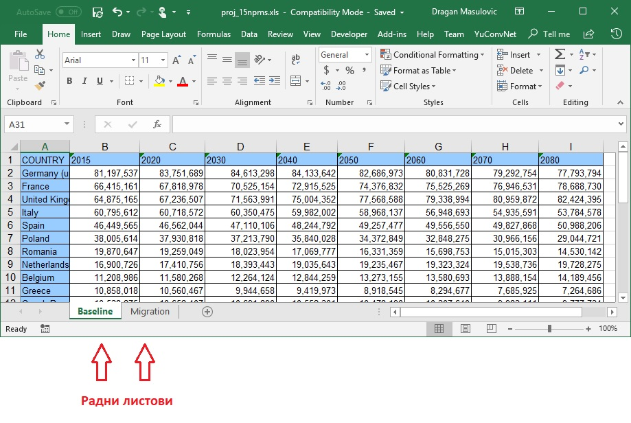

Џупитер и Ексел
================

У овој лекцији ћемо говорити о:

1. односу Џупитера и Ексела;
2. о учитавању података из Ексел датотеке; и
3. о уписивању података у Ексел датотеку.

Зашто Џупитер, а зашто Ексел
-----------------------------

Мајкрософтов Ексел (*Microsoft Excel*) представља један од најраспрострањенијих софтверских производа за обраду табеларно представљених података. Ексел своју популарност дугује томе што је табела у коју се уносе подаци "опипљива", она је ту, корисник може само да кликне на поље и да унесе податак или формулу. Природно се намеће питање зашто овај курс није организован око Ексела. Разлога има много, а навешћемо неколико најважнијих.

* *Цена.* За разлику од Ексела који је комерцијални производ и који мора да се купи да би могао легално да се користи, Пајтон, све његове библиотеке и Џупитер (као радно окружење за Пајтон) су *бесплатни*. Свако може без икакве накнаде да инсталира Пајтон и Џупитер и да их користи за личне потребе и за образовне потребе.

* *Обрада података путем јасно видљиве процедуре.* У ћелије Ексел табеле се, поред текста и бројева, могу унети и формуле. На тај начин се у Екселу може постићи све о чему смо ми овде писали. Проблем са оваквим приступом настаје када покушавамо да схватимо *шта* табела у коју је неко већ унео формуле ради и *како* то она ради. У великим табелама није лако установити која формула зависи од које ћелије и, уопште, којим редом ће се формуле израчунавати. Дакле, лако је поделити са сарадницима Ексел табелу која ће одрадити посао, али није лако поделити са сарадницима *процес* који та табела имплементира. С друге стране, ако су подаци обрађени употребом неког скрипт-језика као што је Пајтон, из самог програма (*и коментара у њему!*) се може реконструисати процес обраде података. На тај начин сарадници на пројекту могу да провере процес обраде података и тако лакше уоче евентуалне грешке у процедури обраде података. Осим тога, ако је потребно извршити нови рачун који је сличан постојећем лакше је прилагодити експлицитан код.

* *Флексибилност.* Пајтон долази са веома великим бројем библиотека које су развијане за потребе ефикасне обраде великих количина података. Све те библиотеке су доступне из Џупитера. Ако се за коју годину појави нека нова библиотека која нуди нове могућности, можемо је лако и брзо увести у Џупитер и користити. За разлику од Пајтона, нове функционалности Ексела се не дистрибуирају кроз библиотеке функција (које се лако додају систему), већ свака нова функционалност изискује инсталацију нове верзије целог програма.

Обрада података путем јасно наведених кратких програма (који нису део табеле!) представља најфлексибилнији начин обраде података и представља окосницу сваког озбиљног система за обраду података. *Зато је важно да се сви сретнемо са програмирањем, чак иако не планирамо сви да будемо програмери!*

Учитавање података из Ексел датотека
----------------------------------------------

Мајкрософтов Ексел (*Microsoft Excel*) представља један од најраспрострањенијих софтверских производа за обраду табеларно представљених података. Библиотека *pandas* зато има функцију која може да учита податке представљене Ексел табелом.

Структура Ексел документа је релативно сложена јер у једном документу може да се налази више табела. Један Ексел документ се, зато, састоји из неколико *радних листова* (енгл. *work sheets*):

па функцији за учитавање Ексел табеле поред имена датотеке треба дати и име радног листа са кога се учитава табела. Уколико се не наведе име радног листа функција ће учитати табелу из првог радног листа на који наиђе. Ово обично користимо само у ситуацијама када смо сигурни да Ексел радна свеска има само један радни лист.

Сада ћемо из датотеке *Aditivi.xlsx* која се налази на удаљеном ресурсу учитати табелу из (јединог) радног листа "Адитиви":

.. ipython::

   In [1]: import pandas as pd
      ...: aditivi = pd.read_excel("https://petljamediastorage.blob.core.windows.net/root/Media/Default/Kursevi/programiranje_II/podaci/Aditivi.xlsx",
      ...:           sheet_name="Адитиви")

Ова датотека садржи податке о адитивима, што су супстанце које се користе у индустрији. Неки од њих се користе и у индустрији хране. (Подаци су преузети из уџбеника биологије за 8. разред.)

Ево првих неколико редова табеле:

.. ipython::

   In [1]: aditivi.head(15)

Видимо да су ћелије које су биле празне у Ексел табели овде добиле специјалну вредност *NaN* што је скраћеница од *not a number* (енгл. "није број"). Ово је специјална вредност која се користи да се открију потенцијалне грешке које могу да настану приликом учитавања великих табела. У нашем случају празне ћелије у колони "Напомена" и треба да остану празне, па ћемо табелу учитати поново, с тим да ћемо "замолити Пајтон да искључи вештачку интелигенцију":

.. ipython::

   In [1]: aditivi = pd.read_excel("https://petljamediastorage.blob.core.windows.net/root/Media/Default/Kursevi/programiranje_II/podaci/Aditivi.xlsx",
      ...:           sheet_name="Адитиви", na_filter=False)
      ...: aditivi.head(15)

Аргумент ``na_filter=False`` каже функцији ``read_excel`` да празне ћелије остану празне и да у њих не уноси вредност *NaN*.

Ево и кратке видео илустрације:

.. ytpopup:: _XYOWXzQnuI
   :width: 735
   :height: 415
   :align: center

Направићемо сада фреквенцијску анализу ове табеле на основу штетности адитива.

.. ipython::

   In [1]: aditivi["Штетност"].value_counts()

Профилтрираћемо табелу да бисмо излистали адитиве који могу изазвати рак.

.. ipython::

   In [1]: aditivi[aditivi.Напомена == "може изазвати рак"]

За крај, излистаћемо адитиве који су изузетно опасни или могу изазвати рак. У ту сврху треба да комбинујемо два критеријума:

.. code-block:: text

    Напомена == "може изазвати рак"  или  Штетност == "ИЗУЗЕТНО ОПАСАН"

Логички везник "или" се у библиотеци ``pandas`` означава симболом ``|``. Према томе, податке добијамо тако што табели проследимо следећи захтев за филтрирање:

.. ipython::

   In [1]: aditivi[(aditivi.Напомена == "може изазвати рак") | (aditivi.Штетност == "ИЗУЗЕТНО ОПАСАН")]

Уписивање табеле у Ексел датотеку
----------------------------------

Било коју табелу можемо да упишемо и у Ексел датотеку као што смо их уписивали у *CSV* датотеке. Потребно је само позвати функцију ``to_excel`` и проследити јој име датотеке. На пример, ако је ``opasni_aditivi`` табела која садржи списак опасних адитива:

.. ipython::

   In [1]: opasni_aditivi = aditivi[(aditivi.Напомена == "може изазвати рак") | (aditivi.Штетност == "ИЗУЗЕТНО ОПАСАН")]

њу можемо уписати у Ексел датотеку овако:

.. code-block:: python

   opasni_aditivi.to_excel("opasni_aditivi.xlsx", encoding="utf-8")

Аргумент ``encoding="utf-8"`` морамо да проследимо функцији зато што у табели имамо податке који су записани ћирилицом, као што је био случај код писања у *CSV* датотеке. Ако сада отворимо ову датотеку из Ексела добићемо овакав изглед:

.. image:: ../../_images/opasni_aditivi.jpg
   :width: 600px
   :align: center

Видимо да је Пајтон уписао и индексну колону што нам у овом случају не одговара. Као и код уписивања у *CSV* датотеке можемо рећи Пајтону да у датотеку не уписује индексну колону тако што ћемо навести још и аргумент ``index=False``:

.. code-block:: python

   opasni_aditivi.to_excel("opasni_aditivi.xlsx", encoding="utf-8", index=False)

Ако сада нову датотеку учитамо из Ексела добијамо

.. image:: ../../_images/opasni_aditivi2.jpg
   :width: 600px
   :align: center

За крај треба још мало проширити колоне у Ексел табели да би се улепшао њен изглед - и готово!

Ево и кратке видео илустрације:

.. ytpopup:: eZgXkfdsvkI
   :width: 735
   :height: 415
   :align: center

Задаци
-------

За вежбу покрени Џупитер окружење и реши задатке из радне свеске J10.ipynb