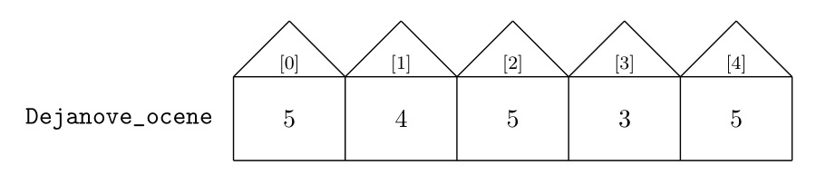

Увод у процесирање низова података
==================================

У овој лекцији ћемо:

1. поновити како се записују низови података,
2. поновити како се дефинишу функције,
3. написаћемо своју функцију која рачуна најмањи број у датом низу бројева, и
4. поновити неколико функција које су уграћене у Пајтон.

Записивање низова података
-------------------------------

Да се подсетимо, низови података се у Пајтону записују унутар угластих заграда,
у облику *листе*. На пример, оцене неког ученика из једног предмета могу да се запишу као низ овако:

.. code-block:: python

   Dejanove_ocene = [2, 4, 5, 3, 5]

Ово је пример нумеричког низа података, где су сви подаци бројеви. Низ података, наравно, не
мора бити нумерички. На пример:

.. code-block:: python

   predmeti = ["matematika", "srpski", "likovno", "istorija", "fizičko"]

или овако:

.. code-block:: python

   Ocene = ["Dejan", 2, 4, 5, 5, 3]

Раније смо видели да подаци у низу могу бити и други низови података:

.. code-block:: python

   Ocene_VIII3 = [
     ["Dejan", 2, 4, 5, 5, 3],
     ["Milica", 4, 5, 5, 4, 5],
     ["Milan", 3, 4, 5, 5, 5]
   ]

О низу података можемо да размишљамо као о улици у којој свака кућица има свој кућни број.
Специфичност Пајтона је у томе да кућни бројеви увек почињу од 0, рецимо овако:

.. image:: ../../_images/Y101.jpg
   :width: 600

Број елемената низа се добија позивом уграђене функције ``len``
(од енглеског *length* што значи "дужина"):

.. activecode:: primer1-5
   :coach:

   predmeti = ["matematika", "srpski", "likovno", "istorija", "fizičko"]
   print(len(predmeti))

Ако желимо да приступимо појединачној кућици довољно је да наведемо њену "адресу" која се,
као и поштанска адреса, састоји од имена улице иза кога се наводи кућни број, рецимо овако:

.. activecode:: primer1-6
   :coach:

   Dejanove_ocene = [2, 4, 5, 3, 5]
   print(Dejanove_ocene[0])

Вредности бројева у кућицама се могу мењати веома једноставно.
Рецимо, ако Дејан је поправио оцену која је уписана у прву кућицу
(*чији кућни број је 0!*) то можемо регистровати овако:

.. activecode:: primer1-7
   :coach:

   Dejanove_ocene = [2, 4, 5, 3, 5]
   Dejanove_ocene[0] = 5
   print(Dejanove_ocene[0])

Стање у улици ``Dejanove_ocene`` сада изгледа овако:

Ако узмемо да низ ``predmeti`` садржи имена предмета из којих је Дејан оцењен онда извештај о Дејановим оценама можемо
исписати на следећи начин:

.. activecode:: primer1-8
   :coach:

   predmeti = ["matematika", "srpski", "likovno", "istorija", "fizičko"]
   Dejanove_ocene = [2, 4, 5, 3, 5]
   print("Dejanove ocene:")
   for i in range(5):
      print(predmeti[i], Dejanove_ocene[i])

Стандардне функције
------------------------

Како би се писање програма поједноставило за велики број важних задатака који се веома
често користе у Пајтону већ постоје функције које их обављају. На пример, функција
``len`` рачуна дужину низа, као што смо већ видели.
Одређивање најмањег и највећег елемента низа бројева спадају међу важне задатке,
и зато Пајтон има уграђене функције ``min`` и ``max`` које могу да одреде најмањи,
односно, највећи елемент неколико бројева који су унапред наведени, или целог низа бројева:

.. activecode:: primer1-9
   :coach:

   print(min(2,3))

.. activecode:: primer1-10
   :coach:

   print(max(4,5,-2))

.. activecode:: primer1-11
   :coach:

   Dejanove_ocene = [2, 4, 5, 3, 5]
   print("Najmanja Dejanova ocena je", min(Dejanove_ocene))
   print("Najveca Dejanova ocena je", max(Dejanove_ocene))

Пример 1.
'''''''''

У следећем малом програму унеси своје оцене из неког предмета и допиши програмски код који ће израчунати
највећу и најмању од њих, као и колико оцена имаш из тог предмета.

.. activecode:: primer1-12
   :coach:

   predmet = "???"  # <-- уместо три упитника упиши име предмета
   ocene = [???] # <-- уместо три упитника упиши своје оцене
   # У наредне три наредбе уместо три упитника упиши ИЗРАЗ који ће
   # ИЗРАЧУНАТИ одговарајући број на основу података у низу ocene
   print("Moja najmanja ocena iz predmeta", predmet, "je", ???)
   print("Moja najveca ocena iz predmeta", predmet, "je", ???)
   print("Imam", ???, "ocena iz predmeta", predmet)

Пример 2.
'''''''''

Функција ``sum`` рачуна збир елемената низа, рецимо овако:

.. activecode:: primer1-13
   :coach:

   brojevi = [3,2,1,4,6]
   print(sum(brojevi))

Просек оцена се рачуна као

.. math::
   \frac{\mathrm{збир\ свих\ оцена}}{\mathrm{укупан\ број\ оцена}}

У следећем малом програму унеси своје оцене из неког предмета и допиши програмски код који ће израчунати
просек товјих оцена из тог предмета.

.. activecode:: primer1-14
   :coach:

   predmet = "???"  # <-- уместо три упитника упиши име предмета
   ocene = [???] # <-- уместо три упитника упиши своје оцене
   # У наредби испод уместо три упитника упиши ИЗРАЗ који ће
   # ИЗРАЧУНАТИ просек оцена на основу података у низу ocene
   print("Prosek mojih ocena iz predmeta", predmet, "je", ???)

Дефинисање функција и минимум низа
---------------------------------------

Када неки компликован процес треба поновити више пута, а не постоји већ дефинисана функција
која то може да уради за нас, постоји могућност да дефинишемо своју функцију.
Функција је мала целина која мора бити именована како бисмо касније могли да је
брзо и лако позовемо кад год нам затреба. На пример, ево функције која исписује извештај о оценама неког
ученика:

.. code-block:: python

   def izvestaj_o_ocenama(ime_ucenika, spisak_predmeta, ocene):
       print("Učenik:", ime_ucenika)
       n = len(spisak_predmeta)
       for i in range(n):
          print("-", spisak_predmeta[i], ocene[i])

Извештај о Дејановим оценама сада лако можемо добити позивом ове функције:

.. activecode:: primer1-15
   :coach:

   # Прво дефинишемо функцију
   def izvestaj_o_ocenama(ime_ucenika, spisak_predmeta, ocene):
       print("Učenik:", ime_ucenika)
       n = len(spisak_predmeta)
       for i in range(n):
          print("-", spisak_predmeta[i], ocene[i])

   # Сада је можемо позвати више пута ако нам треба извештај о оценама
   # за неколико ученика

   predmeti = ["matematika", "srpski", "likovno", "istorija", "fizičko"]
   Dejanove_ocene = [2, 4, 5, 3, 5]
   Milenine_ocene = [5, 5, 4, 5, 4]

   izvestaj_o_ocenama("Dejan", predmeti, Dejanove_ocene)
   izvestaj_o_ocenama("Milena", predmeti, Milenine_ocene)

Функције се најчешће користе за аутоматизацију релативно компликованих рачунских процеса.

Пример 3.
'''''''''

Написати функцију ``min_niza(A)`` која одређује најмањи елемент низа ``A``
и враћа га као резултат свог рада, али без коришћења уграђене функције ``min``.

*Решење.* Погледајмо, прво, како бисмо овај проблем решили када тражимо мањи од два броја, А0 и А1:

.. code-block:: python

   def manji_od_dva(A0, A1):
       if A0 < A1: return A0
       else: return A1

Дакле, ако је А0 мањи, то је резултат рада. У супротном је А1 резултат рада.

Ова идеја ради у случају два броја, али није погодна за уопштења.
Зато ћемо написати нову верзију функције ``manji_od_dva`` која на први поглед делује чудно,
али ће ускоро постати јасно зашто је погодна.

.. code-block:: python

   def manji_od_dva_ponovo(A0, A1):
       manji = A0
       if A1 < manji: manji = A1
       return manji

Идеја се састоји у томе да гледамо елементе један по један, као да нам долазе на траци. Када стигне први елемент, то је најмањи елемен кога смо до сада уочили. Када стигне други елемент проверимо како се он односи према до сада најмањем уоченом елементу и ако је мањи од најмањег до сада, он постаје нови најмањи елемент.

Ево како се идеја коју смо управо описали проширује на три елемента:

..  code-block:: python

   def najmanji_od_tri(A0, A1, A2):
       najmanji = A0
       if A1 < najmanji: najmanji = A1
       if A2 < najmanji: najmanji = A2
       return najmanji

и на ситуацију са пет елемената:

.. code-block:: python

   def najmanji_od_pet(A0, A1, A2, A3, A4):
       najmanji = A0
       if A1 < najmanji: najmanji = A1
       if A2 < najmanji: najmanji = A2
       if A3 < najmanji: najmanji = A3
       if A4 < najmanji: najmanji = A4
       return najmanji

Видимо да се корак који садржи ``if`` понавља за сваки елемент посебно.
Тако се ова идеја лако уопштава на произвољне низове:

.. code-block:: python

   def min_niza(A):
       najmanji = A[0]
       for i in range(len(A)):
           if A[i] < najmanji: najmanji = A[i]
       return najmanji

Да проверимо како ова функција ради:

.. activecode:: primer1-16
   :coach:

   def min_niza(A):
       najmanji = A[0]
       for i in range(len(A)):
           if A[i] < najmanji: najmanji = A[i]
       return najmanji

   print(min_niza([3,1,5,-1,2]))

Задаци
-----------

Задатак 1.
''''''''''

Напиши функцију ``najveci_od_tri(A0, A1, A2)`` која рачуна  и враћа највећи од три дата броја, али без употребе стандардне функције ``max``.
Уместо три упитника напиши тело фукције, па онда провери како функција ради.

.. activecode:: zadatak1-1
   :coach:

   def najveci_od_tri(A0, A1, A2):
       ???

   # Провера
   print(najveci_od_tri(5, 7, 11))
   print(najveci_od_tri(5, 75, 11))
   print(najveci_od_tri(55, 7, 11))

Задатак 2.
''''''''''

Напиши функцију ``najveci_od_pet(A0, A1, A2, A3, A4)``
која рачуна и враћа највећи од пет датих броја, али без употребе стандардне функције ``max``.
Уместо три упитника напиши тело фукције, па онда провери како функција ради.

.. activecode:: zadatak1-2
   :coach:

   def najveci_od_pet(A0, A1, A2):
       ???

   # Провера
   print(najveci_od_pet(1, 2, 3, 4, 55))
   print(najveci_od_pet(1, 2, 3, 44, 5))
   print(najveci_od_pet(1, 2, 33, 4, 5))
   print(najveci_od_pet(1, 22, 3, 4, 5))
   print(najveci_od_pet(11, 2, 3, 4, 5))

Задатак 3.
''''''''''

Напиши функцију ``max_niza(A)`` која за дати низ ``А``
рачуна и враћа највећи елемент, али без употребе стандардне функције ``max``.
Уместо три упитника напиши тело фукције, па онда провери како функција ради.

.. activecode:: zadatak1-3
   :coach:

   def max_niza(A):
       ???

   # Провера
   print(max_niza([1, 2, 3, 4, 55, 6]))
   print(max_niza([1, 2, 3, 4, 55, 777]))
   print(max_niza([111, 2, 3, 4]))
   print(max_niza([1, 222]))
   print(max_niza([22]))

Задатак 4.
''''''''''

Напиши функцију ``min_i_max(A)`` која исписује најмањи и највећи елемент
низа ``А``. (*Напомена: ова функција не треба да врати никакву вредност!
Она само треба да испише два броја на екран.*)
Уместо три упитника напиши тело фукције, па онда провери како функција ради.

.. activecode:: zadatak1-4
   :coach:

   def min_i_max(A):
       ???

   # Провера
   print(min_i_max([1, 2, 3, 4, 55, 6]))
   print(min_i_max([2, 2]))
   print(min_i_max([5]))

Задатак 5*.
'''''''''''

Напиши функцију ``srednji_od_tri(A0, A1, A2)`` која рачуна и враћа средњи од три дата броја.
Уместо три упитника напиши тело фукције, па онда провери како функција ради.

.. activecode:: zadatak1-5
   :coach:

   def srednji_od_tri(A):
       ???

   # Провера
   print(srednji_od_tri(2, 7, 5))
   print(srednji_od_tri(2, 5, 5))
   print(srednji_od_tri(5, 5, 1))
   print(srednji_od_tri(2, 2, 2))
