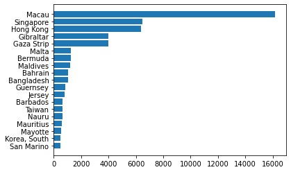

Обрада и приказ табеларних података
===================================

Обраду, анализу и графички приказ података је тешко раздвојити. Све то
углавном иде паралелно. У Пајтону постоји неколико најчешће коришћених
библиотека које су усаглашене тако да објекти које користимо за обраду
података имају функције за цртање, а функције за цртање враћају табеле и
серије. Зато је то овде једна лекција.

Обрада табеларних података
--------------------------

Много тога за шта су нам потребни програмерско знање и труд при обради
података у листама постаје једноставна примена готових функција када
податке спакујемо у *DataFrame*. Библиотека *pandas* омогућава да рад са
табелама буде једноставан, брз и ефикасан.

.. technicalnote::

        Препоручујемо да ову лекцију покренеш на свом рачунару тако што ћеш у `фолдеру за рад офлајн <https://github.com/Petlja/revizija_2_radni/archive/refs/heads/main.zip>`_ покренути Џупитер свеску ``09_obrada.ipynb``, на начин на који је то објашњено у поглављу `Покретање Џупитер радних свески </J0A/J0A.html#jupyter>`_ у уводу овог приручника, или тако што ћеш отићи на `овај линк <https://petlja.github.io/gim2_rac_prog_radni/lab/index.html>`_ и тамо радити задатке.  

Учитавање табеле из датотеке
~~~~~~~~~~~~~~~~~~~~~~~~~~~~

Податке најчешће чувамо у табелама. Чак су и базе података само
колекције различитих табела. За поновну употребу табеле снимамо у
датотеке (или фајлове, како их понекад зовемо). Те снимљене табеле
касније учитавамо по потреби. Уобичајени формат датотека за снимање
табела је CSV (енгл. *comma separated value*, тј. вредности одвојене
зарезом). Библиотека *pandas* има функције за учитавање и снимање
табела. За учитавање користимо функцију ``pd.read_csv()``. Aргумент ове
функције је стринг са локацијом и називом датотеке, нпр.
“data/countries.csv”. Ова датотека се не налази у Пајтоновом радном
директоријуму већ у поддиректоријуму *data*, због чега је потребно да то
напишемо и да назив директоријума и датотеке раздвојимо косом цртом.
Учитаћемо сада баш ту датотеку.

.. code:: ipython3

    import pandas as pd                # prvo uvozimo pandas biblioteku
    import matplotlib.pyplot as plt    # i biblioteku za crtanje grafika

.. code:: ipython3

    dt = pd.read_csv('data/countries.csv')

При позивању функција из одређене библиотеке потребно је да наведемо
ознаке библиотека. Зато није довољно да напишемо ``read_csv()`` већ
морамо ``pd.read_csv()``. При увожењу библиотека ми смо нагласили да
ћемо користити скраћена имена уместо пуних. Користићемо ``pd`` уместо
``pandas`` и ``plt`` уместо ``matplotlib.pyplot`` што ће нам олакшати
писање кôда.

Садржај датотеке смо учитали и сместили у табелу (тачније променљиву
типа *dataframe*) ``dt``. Да бисмо видели шта је учитано, згодно је да
прикажемо на екрану заглавље те табеле са првих неколико редова. За то
нам служи функција ``.head()``.

.. code:: ipython3

    dt.head()

.. raw:: html

    

    
    <table border="1" class="dataframe">
      <thead>
        <tr style="text-align: right;">
          <th></th>
          <th>Country</th>
          <th>Continent</th>
          <th>Population</th>
          <th>Area</th>
        </tr>
      </thead>
      <tbody>
        <tr>
          <th>0</th>
          <td>Afghanistan</td>
          <td>Asia</td>
          <td>31056997</td>
          <td>647500</td>
        </tr>
        <tr>
          <th>1</th>
          <td>Albania</td>
          <td>Europe</td>
          <td>3581655</td>
          <td>28748</td>
        </tr>
        <tr>
          <th>2</th>
          <td>Algeria</td>
          <td>Africa</td>
          <td>32930091</td>
          <td>2381740</td>
        </tr>
        <tr>
          <th>3</th>
          <td>American Samoa</td>
          <td>Oceania</td>
          <td>57794</td>
          <td>199</td>
        </tr>
        <tr>
          <th>4</th>
          <td>Andorra</td>
          <td>Europe</td>
          <td>71201</td>
          <td>468</td>
        </tr>
      </tbody>
    </table>
    

.. code:: ipython3

    sum([1,2,3])

.. parsed-literal::

    6

У колони без имена на почетку са леве стране, тј. индексној колони стоје
бројеви од 0 до *n*-1, при чему је *n* број редова у табели. Свака
табела мора да има индексну колону. То не морају да буду редни бројеви,
али ако при учитавању табеле ништа не нагласимо, Пајтон ће сам да је
направи. Индексна колона служи да се по њој позивају елементи. Елементи
табеле су редови у табели. Тако је ``dt[2]`` ред у ком су подаци за
Алжир. Свака колона у којој нема понављања вредности може да буде
индексна, али се овде нећемо на томе задржавати.

Видимо да су државе наведене по редовима, а да по колонама имамо основне
податке о тим државама. У колони *Country* је име државе, *Continent*
означава континент на ком се налази, *Population* број становника, а
*Area* површину државе у квадратним километрима. Називе свих колона
можемо да добијемо помоћу ``dt.columns``.

.. code:: ipython3

    dt.columns

.. parsed-literal::

    Index(['Country', 'Continent', 'Population', 'Area'], dtype='object')

Вредности које се налазе у одређеној колони се позивају тако што после
имена табеле у угластим заграда наведемо име колоне под једноструким или
двоструким наводницима. Да бисмо приказали колону са именима држава,
написаћемо ``dt['Country']`` или ``dt["Country"]``.

.. code:: ipython3

    dt['Country']

.. parsed-literal::

    0         Afghanistan
    1             Albania
    2             Algeria
    3      American Samoa
    4             Andorra
                ...      
    222         West Bank
    223    Western Sahara
    224             Yemen
    225            Zambia
    226          Zimbabwe
    Name: Country, Length: 227, dtype: object

Ако хоћете да видите само део ове листе, користите *слајсове*. Са
``[:10]`` ћете нпр. добити првих 10, а са ``[10:20]`` других 10
елемената колоне.

.. code:: ipython3

    dt['Country'][10:20]

.. parsed-literal::

    10           Aruba
    11       Australia
    12         Austria
    13      Azerbaijan
    14    Bahamas, The
    15         Bahrain
    16      Bangladesh
    17        Barbados
    18         Belarus
    19         Belgium
    Name: Country, dtype: object

Додавање нових колона
~~~~~~~~~~~~~~~~~~~~~

Табеле могу да се мењају, да се табели додају и бришу колоне и врсте,
као и да се мењају вредности које су већ у табели. Ако бисмо хтели да
додамо колону у којој ће бити густина насељености, треба само да
израчунамо тражене вредности и ставимо их у посебну колону. Довољно је
да, још увек непостојећој, колони са новим именом, нпр. *Density*,
придружимо резултат тог израчунавања.

.. code:: ipython3

    dt['Density']=dt['Population']/dt['Area']

.. suggestionnote::
  Напомена: Приметите како једноставно можемо да поделимо све вредности
  једне колоне са одговарајућим вредностима друге колоне. То са листама
  не можемо да радимо, али ако користимо *pandas* табеле, онда ће
  колоне те табеле бити променљиве типа *Series*. За серије су основне
  математичке операције дефинисане тако да операције вршимо за сваки
  елемент једне серије са одговарајућим елементом из друге. Некад је
  згодно листе претворити у серије како бисмо могли да рачунамо на овај
  начин. То би изгледало отприлике овако:

  .. code::

   lista=[1,2,3]
   serija=pd.Series(lista)
   serija_na_kvadrat=serija*serija

Нова колона са именом *Density* је аутоматски додата чим смо је
израчунали. Можемо да погледамо како изгледа заглавље табеле и тако
проверимо да ли је нова колона додата како треба.

.. code:: ipython3

    lista=[1,2,3]
    serija=pd.Series(lista)
    serija_na_kvadrat=serija*serija

.. code:: ipython3

    dt.head()

.. raw:: html

    

    
    <table border="1" class="dataframe">
      <thead>
        <tr style="text-align: right;">
          <th></th>
          <th>Country</th>
          <th>Continent</th>
          <th>Population</th>
          <th>Area</th>
          <th>Density</th>
        </tr>
      </thead>
      <tbody>
        <tr>
          <th>0</th>
          <td>Afghanistan</td>
          <td>Asia</td>
          <td>31056997</td>
          <td>647500</td>
          <td>47.964474</td>
        </tr>
        <tr>
          <th>1</th>
          <td>Albania</td>
          <td>Europe</td>
          <td>3581655</td>
          <td>28748</td>
          <td>124.587971</td>
        </tr>
        <tr>
          <th>2</th>
          <td>Algeria</td>
          <td>Africa</td>
          <td>32930091</td>
          <td>2381740</td>
          <td>13.826065</td>
        </tr>
        <tr>
          <th>3</th>
          <td>American Samoa</td>
          <td>Oceania</td>
          <td>57794</td>
          <td>199</td>
          <td>290.422111</td>
        </tr>
        <tr>
          <th>4</th>
          <td>Andorra</td>
          <td>Europe</td>
          <td>71201</td>
          <td>468</td>
          <td>152.138889</td>
        </tr>
      </tbody>
    </table>
    

.. mchoice:: pandas1
   :answer_a: 1
   :answer_b: a
   :answer_c: 'а'
   :answer_d: ['а']
   :correct: a
   :feedback_a: Тачно!
   :feedback_b: Пробај поново! 
   :feedback_c: Пробај поново! 
   :feedback_d: Пробај поново! 

   Који ће од наредних израза издвојити бројеве између 1 и 1000 који су дељиви са 3?

Сортирање
~~~~~~~~~

Библиотека *pandas* има прегршт корисних функција за рад са табелама и
њиховим колонама. Функција ``.sort_values()`` сортира све вредности у
одређеној колони и прерасподељује садржај осталих колона у складу са
тим. Ако хоћемо да видимо које то државе имају најмању и највећу густину
насељености, можемо да сортирамо вредности по тој колони и погледамо
које се државе налази на почетку и крају табеле.

.. code:: ipython3

    dt.sort_values('Density')

.. raw:: html

    

    
    <table border="1" class="dataframe">
      <thead>
        <tr style="text-align: right;">
          <th></th>
          <th>Country</th>
          <th>Continent</th>
          <th>Population</th>
          <th>Area</th>
          <th>Density</th>
        </tr>
      </thead>
      <tbody>
        <tr>
          <th>80</th>
          <td>Greenland</td>
          <td>North America</td>
          <td>56361</td>
          <td>2166086</td>
          <td>0.026020</td>
        </tr>
        <tr>
          <th>223</th>
          <td>Western Sahara</td>
          <td>Africa</td>
          <td>273008</td>
          <td>266000</td>
          <td>1.026346</td>
        </tr>
        <tr>
          <th>139</th>
          <td>Mongolia</td>
          <td>Asia</td>
          <td>2832224</td>
          <td>1564116</td>
          <td>1.810751</td>
        </tr>
        <tr>
          <th>70</th>
          <td>French Guiana</td>
          <td>South America</td>
          <td>199509</td>
          <td>91000</td>
          <td>2.192407</td>
        </tr>
        <tr>
          <th>143</th>
          <td>Namibia</td>
          <td>Africa</td>
          <td>2044147</td>
          <td>825418</td>
          <td>2.476499</td>
        </tr>
        <tr>
          <th>...</th>
          <td>...</td>
          <td>...</td>
          <td>...</td>
          <td>...</td>
          <td>...</td>
        </tr>
        <tr>
          <th>78</th>
          <td>Gibraltar</td>
          <td>Europe</td>
          <td>27928</td>
          <td>7</td>
          <td>3989.714286</td>
        </tr>
        <tr>
          <th>91</th>
          <td>Hong Kong</td>
          <td>Asia</td>
          <td>6940432</td>
          <td>1092</td>
          <td>6355.706960</td>
        </tr>
        <tr>
          <th>184</th>
          <td>Singapore</td>
          <td>Asia</td>
          <td>4492150</td>
          <td>693</td>
          <td>6482.178932</td>
        </tr>
        <tr>
          <th>122</th>
          <td>Macau</td>
          <td>Asia</td>
          <td>453125</td>
          <td>28</td>
          <td>16183.035714</td>
        </tr>
        <tr>
          <th>138</th>
          <td>Monaco</td>
          <td>Europe</td>
          <td>32543</td>
          <td>2</td>
          <td>16271.500000</td>
        </tr>
      </tbody>
    </table>
    
227 rows × 5 columns

    

Табеле са великим бројем редова нису прегледне чак ни када их сортирамо. Зато је пожељно да направимо графички приказ који би нам помогао у тумачењу података. Овде ћемо дати примере два типа дијаграма (стубичасти дијаграм и хистограм) за приказ колоне са густином насељености и површином држава. 

Прво дајемо стубичасти дијаграм. Аргументи функције су ознаке стубића (име
државе) и дужина стубића (густина насељености). Пошто држава у табели
има преко 200, тешко је направити прегледан график са свим државамо.
Зато смо узели само двадесет држава са највећом густином насељености.
Због прегледности исписа згодније нам је да стубићи буду хоризонтални.
Зато користимо функцију ``barh()`` уместо ``bar()``. Пробајте и са
``bar()`` да видите како би изгледало.

.. code:: ipython3

    spd=dt.sort_values('Density')                  # sortiramo tabelu po gustini naseljenosti i dodeljujemo je novoj tabeli
    spd20=spd[-20:-1]                              # zbog preglednosti, pomoću slajsa, izdvajamo samo poslednjih 20 redova
    plt.barh(spd20['Country'],spd20['Density'])    # crtamo horizontalni stubični dijagram 

.. parsed-literal::

    <BarContainer object of 19 artists>

.. infonote:: Напомена

  Приметићете да пре цртања графикона Пајтон исписује неки текст. У овом случају је исписао <BarContainer object of 19 artists>. Ако вам овај испис смета, ставите тачка-зарез на крај реда у програму који исцртава графикон. Тада неће исписивати ништа.

Други важан графикон за приказ расподеле података је хистограм. Он нам
даје приказ броја држава по одређеним интервалима вредности за површину
држава. Функција ``.hist()`` дели интервал од најмање до највеће
вредности на десет једнаких под-интервала уколико не наведемо конкретан
број као други аргумент функције. У овом примеру распон од 0 до 20
милиона km² (што задајемо са ``range=(0,2e7)``) делимо на 20 једнаких
интервала и пребројавамо колико држава има у сваком од њих. У првом
интервалу, од 0 до 100 000 квадратних килoмeтара, има скоро 200 држава.
И Србија је међу њима. Ретке су оне које имају површину већу од 300 000
km².

.. code:: ipython3

    plt.hist(spd['Area'],20,range=(0,2e7))
    plt.grid()                               # crtanje mreže na grafikonu

.. image:: ../../_images/output_34_0.png

Филтрирање табеле
~~~~~~~~~~~~~~~~~

Филтрирање значи да од целе табеле желимо да издвојимо само оне редове
који нас интересују. За филтрирање података у табели користимо
критеријуме, односно логичке исказе као што је нпр.
``dt['Continent']=="North America"``. Овде проверавамо које су вредности
у колони ``dt['Continent']`` једнаке стрингу ``"North America"``. У
угласте заграде после назива табеле треба унети тражени критеријум. На
тај начин од целе почетне табеле издвајамо само онај део табеле где је
критеријум испуњен.

На пример, овако можемо да издвојимо само државе које се налазе у
Северној Америци.

.. code:: ipython3

    dt[dt['Continent']=="North America"]

.. raw:: html

    

    
    <table border="1" class="dataframe">
      <thead>
        <tr style="text-align: right;">
          <th></th>
          <th>Country</th>
          <th>Continent</th>
          <th>Population</th>
          <th>Area</th>
          <th>Density</th>
        </tr>
      </thead>
      <tbody>
        <tr>
          <th>22</th>
          <td>Bermuda</td>
          <td>North America</td>
          <td>65773</td>
          <td>53</td>
          <td>1241.000000</td>
        </tr>
        <tr>
          <th>36</th>
          <td>Canada</td>
          <td>North America</td>
          <td>33098932</td>
          <td>9984670</td>
          <td>3.314975</td>
        </tr>
        <tr>
          <th>80</th>
          <td>Greenland</td>
          <td>North America</td>
          <td>56361</td>
          <td>2166086</td>
          <td>0.026020</td>
        </tr>
        <tr>
          <th>174</th>
          <td>St Pierre &amp; Miquelon</td>
          <td>North America</td>
          <td>7026</td>
          <td>242</td>
          <td>29.033058</td>
        </tr>
        <tr>
          <th>214</th>
          <td>United States</td>
          <td>North America</td>
          <td>298444215</td>
          <td>9631420</td>
          <td>30.986523</td>
        </tr>
      </tbody>
    </table>
    

Слично можемо да издвојимо све државе са мање од 20000 становника. Шта
мислите колико их има?

.. code:: ipython3

    dt[dt['Population']<20000]

.. raw:: html

    

    
    <table border="1" class="dataframe">
      <thead>
        <tr style="text-align: right;">
          <th></th>
          <th>Country</th>
          <th>Continent</th>
          <th>Population</th>
          <th>Area</th>
          <th>Density</th>
        </tr>
      </thead>
      <tbody>
        <tr>
          <th>6</th>
          <td>Anguilla</td>
          <td>South America</td>
          <td>13477</td>
          <td>102</td>
          <td>132.127451</td>
        </tr>
        <tr>
          <th>140</th>
          <td>Montserrat</td>
          <td>South America</td>
          <td>9439</td>
          <td>102</td>
          <td>92.539216</td>
        </tr>
        <tr>
          <th>144</th>
          <td>Nauru</td>
          <td>Oceania</td>
          <td>13287</td>
          <td>21</td>
          <td>632.714286</td>
        </tr>
        <tr>
          <th>171</th>
          <td>Saint Helena</td>
          <td>Africa</td>
          <td>7502</td>
          <td>413</td>
          <td>18.164649</td>
        </tr>
        <tr>
          <th>174</th>
          <td>St Pierre &amp; Miquelon</td>
          <td>North America</td>
          <td>7026</td>
          <td>242</td>
          <td>29.033058</td>
        </tr>
        <tr>
          <th>209</th>
          <td>Tuvalu</td>
          <td>Oceania</td>
          <td>11810</td>
          <td>26</td>
          <td>454.230769</td>
        </tr>
        <tr>
          <th>221</th>
          <td>Wallis and Futuna</td>
          <td>Oceania</td>
          <td>16025</td>
          <td>274</td>
          <td>58.485401</td>
        </tr>
      </tbody>
    </table>
    

.. questionnote::

  Испишите податаке из табеле `dt` за европске земље са више од 20 милиона становника.

Записивање табеле у датотеку
~~~~~~~~~~~~~~~~~~~~~~~~~~~~

Измењену табелу, за почетак, имамо само у меморији рачунара. Ако хоћемо
да сачувамо те измене, потребно је да снимимо табелу у датотеку.
Функција коју користимо за ту намену је ``.to_csv()``. Аргумент функције
је назив датотеке у коју ћемо да снимимо табелу.

.. code:: ipython3

    dt.to_csv('data/countries2.csv')

Статистички и графички приказ табеларних података
-------------------------------------------------

Статистичко и графичко приказивање података тешко је раздвојити. Велики
број података, без обзира да ли их је 20 или 20 милијарди, приказујемо у
сведеном облику користећи мањи број карактеристичних вредности или
графички приказ расподела и вредности података. Не постоји “најбољи
начин” за приказивање података. Избор начина приказа зависи од природе
податка. Морамо да их познајемо да бисмо знали шта да ставимо у први
план. Почећемо са једноставнијим примерима – са низовима података.

Колоне са номиналним подацима
~~~~~~~~~~~~~~~~~~~~~~~~~~~~~

У табели типа *dataframe* можемо да имамо различите типове података.
Битно је само да су у једној колони сви подаци истог типа. Два
најважнија типа података, заправо групе типова су номинални (или
категоријални) и нумерички подаци. Номинални подаци означавају нека
имена, називе или кратке текстуалне описе. Имена држава представљају
номиналне податке. Чак и када се означавају бројем (нпр. број зграде у
улици), ти подаци остају номинални. Са тим бројевима се ништа не рачуна.
Већина номиналних података су стрингови који означавају различите
објекте. Једина статистика коју можемо да радимо са номиналним подацима
јесте да пребројимо колико их има, тј. да видимо колико се често
појављују.

У табели ``dt`` имамо колону са именом континента на ком се држава
налази. Ако бисмо пребројали колико се пута појављују ови подаци, видели
бисмо колико држава имамо на ком континенту. Библиотека *pandas* нам
омогућава да то радимо помоћу функције ``.value_counts()`` коју
применимо на одговарајућу колону.

.. code:: ipython3

    vc=dt['Continent'].value_counts()
    print(vc)

.. parsed-literal::

    Africa           57
    Asia             52
    Europe           47
    South America    45
    Oceania          21
    North America     5
    Name: Continent, dtype: int64
    

Видимо да је резултат функције ``.value_counts()`` серија у којој су
наведени континенти са бројем држава које тај континент има. Серије су у
суштини табеле са само једном колоном. Као што табеле осим регуларних
колона имају и индексну колону у којој су имена редова, тако и серије
имају низ са вредностима и индексни низ у ком су имена редова, тј.
елемената у серији. Конкретно, серија ``vc`` има низ са вредностима
``vc.values`` (број држава на континенту) и индексни низ ``vc.index``
(име континента).

.. code:: ipython3

    vc.values

.. parsed-literal::

    array([57, 52, 47, 45, 21,  5], dtype=int64)

.. code:: ipython3

    vc.index

.. parsed-literal::

    Index(['Africa', 'Asia', 'Europe', 'South America', 'Oceania',
           'North America'],
          dtype='object')

Колоне са нумеричким подацима
~~~~~~~~~~~~~~~~~~~~~~~~~~~~~

Бројеви могу да се пореде међусобно по величини. Са бројевима могу да се
раде и рачунске операције. Због тога су могућности за обраду и анализу
нумеричких низова много веће него за номиналне. Наш основни задатак је
да цео низ података што једноставније и разумљивије представимо. Низ
података често поједностављено приказујемо помоћу карактеристичних
вредности, као што је нпр. средња вредност. Други важан начин је да цео
низ података прикажемо графички како бисмо податке могли да “видимо”.

Описивање низова података преко карактеристичних вредности
~~~~~~~~~~~~~~~~~~~~~~~~~~~~~~~~~~~~~~~~~~~~~~~~~~~~~~~~~~

Шта је просек? Просек није дефинисан као посебна математичка функција.
Просек је било која вредност (као што су средња вредност, мод или
медијана) која се узима за карактеристичну вредност једног скупа
различитих података. Кад се каже просек, најчешће се мисли на средњу
вредност (аритметичку средину), али просек може да буде и медијана или
мод. Врло је важно да се нагласи шта подразумевамо под просеком.
Конкретно, просек оцена у школи је њихова аритметичка средина.

За рачунање средње вредности се користи *pandas* функција ``.mean()``
која се примењује на нумеричку колону у табели. Користећи табелу са
подацима о државама израчунаћемо средњу вредност површина држава.

.. code:: ipython3

    dt['Area'].mean()

.. parsed-literal::

    598226.9559471365

Средња вредност површина свих држава је приближно 598 000 km². Толика би
била површина сваке појединачне државе на свету када би територија била
равномерно распоређена. Ми, међутим, знамо да постоје минијатурне државе
са по неколико квадратних километра, док са друге стране имамо Русију са
17 милиона km². Шта нам говори средња вредност? Да ли је површина
типичне државе на овој планети?

Ако погледамо хистограм површине држава, видећемо да је највише малих
држава, а да су врло ретке оне са више милиона km². Држава са површином
598 000 km² би била заста велика. Не рачунајући Русију, само би Украјина
од европских држава имала већу површину. То свакако не би била типична
држава. Од ње би 45 држава биле веће, док би чак 182 биле мање. Боља
мера за типичну површину државе би била да има подједнак број држава
које имају већу и држава које имају мању површину. Пошто имамо 227
држава, она која се налази на 114 месту по површини одговара том
критеријуму.

Да бисмо видели која је 114 држава по површини, сортираћемо табелу
``dt`` тако да не буде у растућем већ у опадајућем редоследу
(``acdending=False``) и тако да занемари старе индексе и постави нове
према (``ignore_index=True``). Онда ћемо помоћу *слајса* приказати
редове од 112 до 114, који због тога што први ред има индекс 0,
одговарају државама са 113, 114. и 115. највећом површином.

.. code:: ipython3

    sdt=dt.sort_values('Area',ascending=False,ignore_index=True) # sortiramo u opadajućem resoledu
    sdt[112:115] # izdavajamo redove 112, 113 i 114 pomoću slajsa

.. raw:: html

    

    
    <table border="1" class="dataframe">
      <thead>
        <tr style="text-align: right;">
          <th></th>
          <th>Country</th>
          <th>Continent</th>
          <th>Population</th>
          <th>Area</th>
          <th>Density</th>
        </tr>
      </thead>
      <tbody>
        <tr>
          <th>112</th>
          <td>Serbia</td>
          <td>Europe</td>
          <td>9396411</td>
          <td>88361</td>
          <td>106.341157</td>
        </tr>
        <tr>
          <th>113</th>
          <td>Azerbaijan</td>
          <td>Asia</td>
          <td>7961619</td>
          <td>86600</td>
          <td>91.935554</td>
        </tr>
        <tr>
          <th>114</th>
          <td>Austria</td>
          <td>Europe</td>
          <td>8192880</td>
          <td>83870</td>
          <td>97.685466</td>
        </tr>
      </tbody>
    </table>
    

Површина типичне државе је 86 600 km² колика је површина Азербејџана.
Исту ову вредност смо могли да добијемо помоћу функције ``.median()``.

.. code:: ipython3

    dt['Area'].median()

.. parsed-literal::

    86600.0

**Медијана** је математичка функција која нам даје средишњу вредност за
низ који је сортиран по величини. Она дели низ на два дела са истим
бројем елемената. Ако низ, на пример, садржи висине 101 ученика,
медијана нам даје висину 51. највишег ученика. Од њега има 50 виших и 50
нижих, док је он у самој средини. Ако имамо паран број ученика, онда
нема ученика који је баш у средини па се медијана рачуна мало другачије:
као средња вредност висине првог елемента испод и првог изнад те
средине. То значи да је медијана низа од 100 бројева, средња вредност
50. и 51. највеће вредности овог низа.

.. questionnote::

  Одредите медијану броја становника за државе света. Да ли за Србију можемо да кажемо да је типична држава и по овом параметру?

Трећа помињана мера за карактеристичну вредност је мод. Она говори о
томе која се вредност понавља највише пута. Функција која рачуна мод је
``.mode()``. Она се, пре свега, примењује за номиналне податке.

.. questionnote::
  
  Одредите медијану броја становника за државе света. Да ли за Србију можемо да кажемо да је типична држава и по овом параметру?

.. code:: ipython3

    dt['Population'].median()

.. parsed-literal::

    4786994.0

Приметите како код школских оцена обе мере: и средња вредност и медијана
добро карактеришу цео низ оцена. То је зато што су оцене углавном
груписане и немају велике екстреме. Међутим, када поредимо средњу
вредност и медијану за низ у ком су неке вредности милион пута веће од
неких других, ове две мере дају прилично различите вредности.

.. code:: ipython3

    niz_ocena=[5,5,3,4,5,4]
    serija=pd.Series(niz_ocena)               # lakše je računati kad listu pretvorimo u seriju
    print('Средња вредност:', serija.mean()) # onda možemo da primenimo pandas funkcije
    print('Медијана:', serija.median()) # .mean() i .median()

.. parsed-literal::

    Средња вредност: 4.333333333333333
    Медијана: 4.5
    

Екстреме имамо код површине држава и броја становника. Погледајте
хистограм држава по површини. Највише је оних малих које видимо као врло
висок стубић са леве стране, док су са десне само појединачни случајеви
врло ретких великих држава. Не улазећи даље у тумачење података, хоћемо
само да покажемо колико средња вредност и медијана могу да се разликују.
На графикону доле, црвеном линијом је обележена медијана, а наранџастом
средња вредност. Пробајте сами да откријете шта ради која линија у
програму.

.. code:: ipython3

    mArea=dt['Area'].mean()
    mdArea=dt['Area'].median()
    plt.hist(dt['Area'],40,range=(0,2e6))
    plt.grid()
    plt.vlines(mArea,0,100,colors='orange')
    plt.vlines(mdArea,0,100,colors='red');

.. image:: ../../_images/output_72_0.png

Груписање и рачунање статистика за групе
~~~~~~~~~~~~~~~~~~~~~~~~~~~~~~~~~~~~~~~~

За анализе података по групама користимо функцију ``groupby()``. У
примеру са државама света, можемо да направимо преглед укупне површине
или броја становника груписаних по континентима. Аргумент функције је
назив колоне по којој групишемо податке.

.. code:: ipython3

    bspk=dt.groupby('Continent')

Структура коју добијамо после груписања није *dataframe* већ сложенији
тип податка који није погодан за приказивање на екрану. Када изаберемо
податак који групишемо и функцију којом то радимо, онда резултат постаје
серија. У примеру који наводимо груписаћемо податке о броју становника
тако што ћемо те површине сабрати. За то користимо функцију ``.sum()``.
Слично бисмо, користећи неке друге функције, могли да нађемо државе са
најмањим бројем становника по континентима или средње вредности броја
становника.

.. code:: ipython3

    bspk['Population'].sum()

.. parsed-literal::

    Continent
    Africa            910844133
    Asia             3958768088
    Europe            727803762
    North America     331672307
    Oceania            33131662
    South America     561824599
    Name: Population, dtype: int64

.. questionnote::
  
  Израчунајте колика је средња густина становништва за сваки континент.
