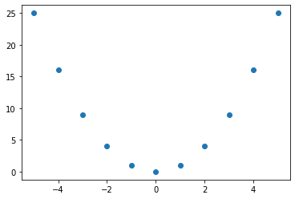
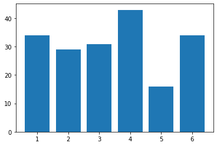
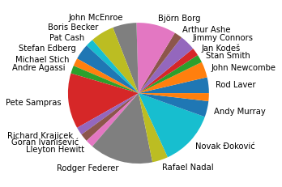

Графичко представљање низова података
-------------------------------------

Велику количину података није лако представити. Због тога се подаци
организују у табеле, групишу и пребројавају. Зато се раде обрада и
анализа података. Да би овај процес био једноставнији и разумљивији,
потребно је да „видимо“ податаке. Графичко представљање података постоји
већ вековима, али никада није било тако важно као данас када је количина
података са којом се срећемо неупоредиво већа него раније. Графичко
приказивање података, или **визуелизација**, има задатак да верно
прикаже податке и истакне оно што сматрамо најважнијим. Иако ова два
захтева могу да буду супротстављена, добра визуелизација мора да испуни
оба.

Да бисмо податке графички приказали у Пајтону, потребно је да их
организујемо у низове или табеле.

.. technicalnote::

        Препоручујемо да ову лекцију покренеш на свом рачунару тако што ћеш у `фолдеру за рад офлајн <https://github.com/Petlja/revizija_2_radni/archive/refs/heads/main.zip>`_ покренути Џупитер свеску ``05_predstavljanje_nizova.ipynb``, на начин на који је то објашњено у поглављу `Покретање Џупитер радних свески </J0A/J0A.html#jupyter>`_ у уводу овог приручника, или тако што ћеш отићи на `овај линк <https://petlja.github.io/gim2_rac_prog_radni/lab/index.html>`_ и тамо радити задатке.  

Коришћење библиотеке ``matplotlib.pyplot`` за визуелизацију
~~~~~~~~~~~~~~~~~~~~~~~~~~~~~~~~~~~~~~~~~~~~~~~~~~~~~~~~~~~

Стандардна Пајтонова библиотека нема функције за цртање графика. Зато је
неопходно да увеземо неку која те функције има. Најчешће се за
визуелизацију увози библиотека ``matplotlib.pyplot``. Због тога многи
Пајтон програми на самом почетку имају
``import matplotlib.pyplot as plt``, што значи да одмах увозимо тражену
библиотеку компликованог имена уз напомену да ћемо је убудуће позивати
преко скраћеног имена ``plt``.

.. code:: ipython3

    import matplotlib.pyplot as plt

Ова библиотека има огроман број различитих функција и опција за
приказивање резултата. (Пробајте ``dir(plt)`` да видите шта све у
библиотеци постоји.) Ми ћемо овде приказати само неколико најчешће
коришћених.

Линијски, тачкасти и стубичасти дијаграми
~~~~~~~~~~~~~~~~~~~~~~~~~~~~~~~~~~~~~~~~~~

Екран рачунара, као и папир на ком цртамо графиконе, има две димензије
које користимо за потребе визуелизације. Где год да ставимо тачку, она
име две координате: *x* по хоризонтали и *y* по вертикали. Како год да
приказујемо податке, морамо да их сведемо на две димензије и да цео
графикон прикажемо као скуп тачака у равни. Због тога су
најједноставнији они графикони где низ тачака одређују два низа
координата, један за *x*, други за *y* осу.

У следећем примеру ћемо помоћу функције ``scatter()`` приказати
**тачкасти дијаграм**, то јест тачке одређене са два низа координата:
``x=[3,4,5]`` и ``y=[4,2,1]``. Приметите како за низове координата
користимо листе. Тако је најједноставније.

.. code:: ipython3

    x=[3,4,5]
    y=[4,2,1]
    plt.scatter(x,y)

.. parsed-literal::

    <matplotlib.collections.PathCollection at 0x24e3d41ed00>

.. image:: ../../_images/output_46_1.png

Вероватно примећујете да координатни систем не почиње од нуле. Функција
сама подешава границе тако да максимално искористи простор који је на
располагању. То можете да промените сами помоћу функција ``xlim()`` и
``ylim()``. Ставите, на пример,

::

   plt.xlim([0,6])
   plt.ylim([0,6])

одмах после линије у којој је ``scatter()`` функција.

.. infonote:: Напомена

    Осим што цртају график, графичке функције, као и било које друге функције, врећају одговарајућу вредност. У претходном примеру смо видели да је изнад графика исписан текст ``<matplotlib.collections.PathCollection at 0x1866f81a460>``. Та нам вредност као повратна информација углавном није потребна, а често квари изглед графика. Ако желимо да функција не исписује ту вредност, на крају реда који исцртава график ставите тачка-зарез ``;``. У наредним примерима ћемо овако завршавати ове линије кода како не би било непотребног исписа.

Претходни пример је вероватно превише једноставан па ћемо дати још
један. Ми у пракси ретко кад укуцавамо све вредности које треба
приказати на графику. Податке за график или учитавамо из неког фајла или
их рачунамо. Овде ћемо дати пример са рачунањем вредности. Конкретно,
узећемо све целобројне вредности од -5 до 5 за *x* координату, а њихове
квадрате за *y* координату.

Начин на који записујемо све бројеве од -5 до 5 вам је можда необичан,
али не желимо да куцамо свих 11 бројева. Зато користимо колекцију типа
``range``, која даје све те бројеве, да би је потом претворили у листу
помоћу функције ``list()``. За другу координату рачунамо вредности
користећи *list comprehension* конструкцију. Унутар угластих заграда
пише да у листу уносимо квадрате броја ``t`` за свако ``t`` из листе
``x``. На крају прикажемо податке на графику као што смо радили и у
претходном примеру.

.. code:: ipython3

    x=list(range(-5,6))
    y=[t**2 for t in x]
    plt.scatter(x,y)

.. parsed-literal::

    <matplotlib.collections.PathCollection at 0x24e3dbee250>

.. suggestionnote::
    
    Ако желите да се на графику појави мрежа хоризонталних и вертикалних линија за вредности које су већ означене на x и y оси, после линије која исцртава график додајте линију која црта мрежу: plt.grid().

Тачкасти дијаграми су стандардни начин приказа података који су добијени
мерењем. Ипак, често се уместо тачкастих користе **линијски дијаграми**
који суседне тачке у низу повезују правим линијама, односно дужима. За
овај тип дијаграма користимо функцију ``plot()``. Да видимо сад исте оне
податке од малопре на линијском дијаграму.

.. code:: ipython3

    x=list(range(-5,6))
    y=[t**2 for t in x]
    plt.plot(x,y)

.. parsed-literal::

    [<matplotlib.lines.Line2D at 0x24e3dc53430>]

.. image:: ../../_images/output_51_1.png

Овако смо добили изломљену криву линију која личи на параболу. Ако
хоћете да буде мање изломљена, узмите више тачака из интервала од -5 до
5.

Некад имамо само један низ података који хоћемо да прикажемо графички.
На пример, број поена који је дао Стеф Кари у финалној серији НБА лиге:
34, 29, 31, 43, 16, 34. Како да прикажемо ове податке кад имамо само
једну координату? Истина је, заправо, да имамо и другу, само што није
експлицитно наведена. То је редни број утакмице. Пошто података о броју
поена има шест, онда су одговарајуће вредности за *x* координату бројеви
од 1 до 6.

.. code:: ipython3

    pts=[34,29,31,43,16,34]
    plt.bar([1,2,3,4,5,6],pts)

.. parsed-literal::

    <BarContainer object of 6 artists>

За разлику од тачкастих и линијских дијаграма, где вредности за *x* и *y*
координате могу да имају било које нецелобројне вредности, **стубичне
дијаграме** обично користимо за податке који на *x* оси имају узастопне
целобројне вредности, редне бројеве или чак стрингове као називе
категорија. Идеја стубичног дијагарама је да омогући лако поређење
између вредности у низу. То се најбоље види ако су вредности на *x* оси
еквидистантне (тј. да су растојања између суседних стубића иста). Због
тога су редни бројеви или називи категорија идеални.

**Задатак**: Прикажите стубични дијаграм за фреквенције одређених
бројева ципела садржаних у листи ``bc``.

.. code:: ipython3

    plt.bar(interval,bp)

.. parsed-literal::

    <BarContainer object of 12 artists>

.. image:: ../../_images/output_57_1.png

Стубични дијаграм је намењен независно променљивим које имају дискретне,
тј. унапред утврђене фиксне вредности. То не морају да буду само
нумеричке, већ и номиналне променљиве.

У листи која следи наведена су имена свих победника Вимблдона у мушкој
конкуренцији у „опен ери“, тј. од 1968. до 2022. године. Можете ли да
прикажете фреквенције победника помоћу стубичног дијаграма?

.. code:: ipython3

    ww=["Rod Laver", "Rod Laver", "John Newcombe", "John Newcombe", "Stan Smith", "Jan Kodeš", "Jimmy Connors", 
        "Arthur Ashe", "Björn Borg", "Björn Borg", "Björn Borg", "Björn Borg", "Björn Borg", "John McEnroe",
        "Jimmy Connors", "John McEnroe", "John McEnroe", "Boris Becker", "Boris Becker", "Pat Cash", "Stefan Edberg",
        "Boris Becker", "Stefan Edberg", "Michael Stich", "Andre Agassi", "Pete Sampras", "Pete Sampras",
        "Pete Sampras", "Richard Krajicek", "Pete Sampras", "Pete Sampras", "Pete Sampras", "Pete Sampras",
        "Goran Ivanišević", "Lleyton Hewitt", "Rodger Federer", "Rodger Federer", "Rodger Federer", "Rodger Federer",
        "Rodger Federer", "Rafael Nadal", "Rodger Federer", "Rafael Nadal", "Novak Đoković", "Rodger Federer",
        "Andy Murray", "Novak Đoković", "Novak Đoković", "Andy Murray", "Rodger Federer", "Novak Đoković",
        "Novak Đoković", "", "Novak Đoković", "Novak Đoković"]

.. code:: ipython3

    ji=[]                               # lista jedinstvenih imena
    bpw=[]                              # lista broja pojavljivanja u ji listi
    for x in ww:                        # za svaki element liste ww
        if x not in ji:                 # ako ime nije već u listi jedinstvenih imena
            ji.append(x)                # dodaj ga u listu
            broj_pobeda=ww.count(x)     # prebroj koliko se puta pojavljuje u listi ww
            bpw.append(broj_pobeda)     # dodaj broj pobeda u listu bpw za to jedinstveno ime
    plt.barh(ji,bpw);                   # nacrtaj (horizonatlni) stubičasti dijagram za ji i bpw

.. parsed-literal::

    <BarContainer object of 22 artists>

.. image:: ../../_images/output_61_1.png

Због прегледности дијаграма, тачније имена тенисера, овде смо нацртали
хоризонтални стубичасти (или тракасти) дијаграм. Само смо уместо функције
``.bar()`` користили ``.barh()``.

Тумачење овог дијаграма можете да урадите сами. У јулу 2022. године,
Федерер (још увек) има највећи број освојених Вимблдона. Ажурирајте ове
податке ако се нешто значајно промени у будућности.

**Секторски дијаграми** (или „питице“) могу да прикажу исте ове податке. Они површину круга деле на делове (секторе) чије су површине сразмерне вредностима у низу. Овај тип дијаграма се сматра атрактивним иако има лошу прегледност и слабе могућности поређења вредности у низу. Секторске дијаграме не би требало користити када је потребно да се лако упореде вредности у низу или да се уочи тренд промене. Ови дијаграми имају највише смисла када приказују удео одређених вредности у укупном броју.

.. code:: ipython3

    plt.pie(bpw,labels=ji)
    plt.grid()

Хистограм
~~~~~~~~~

**Хистограм** је графички приказ расподеле бројчаних података у
одређеном скупу. Идеја хистограма је да се распон од најмањег до
највећег броја у скупу подели на интервале исте ширине, да се преброји
колико бројева упада у који од тих интервала и да се, коначно, резултат
тог пребројавања прикаже као стубичасти дијаграм по тим интервалима.

Иако хистограм изгледа као стубичасти дијаграм, постоје разлике. Док се
стубичасти дијаграм приказује за низ бројева на *x* оси, код хистограма се
стубићи придружују интервалима. Осим тога, хистограм пре приказивања
ради статистичку обраду података, односно дељење на интервале и
пребројавање одговарајућих вредности.

Да бисмо добили неке случајне вредности бројева које треба приказати на
хистограму, прво ћемо генерисати један од таквих бројева помоћу функције
``random()`` из ``random`` библиотеке. Ова функција даје случајан број
између 0 и 1. Ако 100 пута генеришемо случајан број на овај начин и све
их ставимо у листу, добићемо низ од 100 независно добијених случајних
бројева.

.. code:: ipython3

    import random                             # prvo uvozimo biblioteku
    rb=[random.random() for i in range(100)]  # za pravljenje liste koristimo list comprehension
    print(rb[0:6])                            # prikazujemo prvih nekoliko brojeva iz liste

.. parsed-literal::

    [0.2892938921375111, 0.20248641226680386, 0.3309940636093184, 0.4324842008887402, 0.37595924481469134, 0.7259436975407871]
    

Да не бисмо штампали вредности свих сто елемената листе, боље да их
прикажемо као хистограм. За то користимо функцију ``hist()``, која има
само један аргумент: назив листе.

.. code:: ipython3

    plt.hist(rb)

.. parsed-literal::

    (array([11.,  7.,  7., 16., 17.,  9.,  6., 12.,  6.,  9.]),
     array([0.00609241, 0.10477677, 0.20346114, 0.30214551, 0.40082988,
            0.49951425, 0.59819862, 0.69688299, 0.79556736, 0.89425173,
            0.99293609]),
     <BarContainer object of 10 artists>)

.. image:: ../../_images/output_72_1.png

Добили смо хистограм. Додуше, ако хоћемо да будемо цепидлаке, он није
најпрегледнији јер не знамо где су тачно границе интервала и колике су
за њих вредности стубића. То можемо још мало да средимо. Прво ћемо да
кажемо функцији ``hist()`` да не дели интервал од најмање до највеће
вредности на подинтервале, него да то уради за интервал од 0 до 1. То
радимо тако што функцији, уз аргумент који смо већ унели, саопштимо и да
су границе тог великог интервала (*range*) 0 и 1. Онда ће границе
подинтервала бити тачно на 0, 0.1, 0.2, итд. Друго, нацртаћемо мрежу
(*grid*) преко графика да бисмо боље видели вредности и границе
интервала.

.. code:: ipython3

    plt.hist(rb,range=(0,1))
    plt.grid()

.. image:: ../../_images/output_74_0.png

Сада је резултат свакако прегледнији и лакши за читање.
